# AI Video Download Workflow Changes

## Current Workflow - Real Function Call Diagram


## Proposed Workflow - Real Function Call Diagram


## Current Implementation Flow - Component Level

```mermaid
flowchart TD
    A[User clicks Generate] --> B[AI Video Store]
    B --> C{Video Generation}
    C -->|Immediately| D[Add to Media Store]
    D --> E[Video Timeline Preview Component]
    E --> F[shouldRegenerateTimelinePreviews]
    F -->|true| G[generateTimelinePreviews]
    G --> H[generateEnhancedThumbnails]
    H --> I[generateThumbnailsViaCanvas]
    I -->|timeout 3s| J[❌ Canvas fails]
    J --> K[FFmpeg fallback]
    K -->|no file| L[❌ FFmpeg fails]
    L --> M[Timeline shows error]
    M --> N[Component re-renders]
    N --> F
    
    style D fill:#ff9999
    style J fill:#ff9999
    style L fill:#ff9999
    style M fill:#ff9999
```



## Proposed Implementation Flow - Component Level

```mermaid
flowchart TD
    A[User clicks Generate] --> B[AI Video Store]
    B --> C[AIVideoOutputManager.startDownload]
    C --> D[Show Download Progress UI]
    D --> E{Download Complete?}
    E -->|No| F[Update Progress %]
    F --> D
    E -->|Yes| G[AIVideoOutputManager.completeDownload]
    G --> H[uploadToMedia with File object]
    H --> I[Add to Media Store]
    I --> J[Video Timeline Preview Component]
    J --> K[shouldRegenerateTimelinePreviews]
    K -->|true| L[generateTimelinePreviews]
    L --> M[generateEnhancedThumbnails]
    M --> N[generateThumbnailsViaCanvas]
    N -->|may timeout| O[FFmpeg fallback]
    O -->|file ready| P[✅ FFmpeg succeeds]
    P --> Q[Timeline shows previews]
    
    style I fill:#99ff99
    style P fill:#99ff99
    style Q fill:#99ff99
```



## Current Issue Analysis
The AI-generated video "AI (Seedance v1 Lite): a supermodel walking..." is showing "Preview generation timed out" errors because the video is being added to the media panel before the AI generation is complete, causing thumbnail generation failures.

## Current Workflow Problems
1. AI video appears in media panel immediately upon generation start
2. Timeline preview generation attempts to process incomplete/unavailable video
3. Multiple failed attempts to generate thumbnails for incomplete media
4. Poor user experience with timeout errors
5. Repeated function calls creating performance issues

## Proposed Solution Benefits
Implement a two-stage workflow where AI-generated videos are first downloaded to a local output folder, then uploaded to the media panel only after completion, ensuring clean function call flow and proper state management.

---

# 📋 Detailed File Modification Plan

## Files to Create (New)

### 1. **AI Video Output Manager**
**File**: `apps/web/src/lib/ai-video-output.ts`
**Purpose**: Manage local video downloads and progress tracking
**Key Functions**:
- `startDownload(videoId, prompt, model)` 
- `updateProgress(videoId, progress)`
- `completeDownload(videoId, duration)`
- `getDownloadStatus(videoId)`

---

## Files to Modify (Existing)

### 2. **AI Video Client** 
**File**: `apps/web/src/lib/ai-video-client.ts`
**Lines to Modify**: `76-120` (generateVideo function)

**Current Code (Line 76)**:
```typescript
export async function generateVideo(
  request: TextToVideoRequest,
  onProgress?: (progress: number) => void
): Promise<VideoGenerationResult>
```

**Modifications Needed**:
- **Line 76**: Add `outputPath?: string` parameter
- **Line 90-98**: Modify to stream video data to local file instead of returning blob
- **Line 100-110**: Add file writing logic with progress callbacks
- **Line 115**: Return file path instead of blob URL

**Changes**:
```typescript
// Line 76 - Update function signature
export async function generateVideo(
  request: TextToVideoRequest,
  onProgress?: (progress: number) => void,
  outputPath?: string  // NEW PARAMETER
): Promise<VideoGenerationResult>

// Line 100-110 - Add streaming download logic
if (outputPath) {
  const response = await fetch(result.video_url);
  const reader = response.body?.getReader();
  // Stream to local file with progress tracking
}
```

### 3. **AI Component (Main UI)**
**File**: `apps/web/src/components/editor/media-panel/views/ai.tsx`
**Lines to Modify**: `455-560` (handleGenerate function and media integration)

**Current Code (Line 455)**:
```typescript
const handleGenerate = async () => {
  // ... existing generation logic
```

**Current Code (Lines 526-560)**:
```typescript
// Line 537: Immediate media addition
await addMediaItem(activeProject.id, {
  id: generateUUID(),
  name: `AI (${selectedModel}): ${prompt.substring(0, 30)}...`,
  type: 'video' as const,
  file: file,  // THIS IS THE PROBLEM - file not ready
  url: videoUrl,
  // ...
});
```

**Modifications Needed**:
- **Line 455-470**: Import and initialize `AIVideoOutputManager`
- **Line 480-500**: Replace immediate `addMediaItem` with `startDownload`
- **Line 510-530**: Add progress tracking UI updates
- **Line 535-550**: Move `addMediaItem` to completion handler
- **Line 555-560**: Add error handling for download failures

**Changes**:
```typescript
// Line 455 - Add output manager
const outputManager = new AIVideoOutputManager();

// Line 480-500 - Replace immediate addition
const localPath = await outputManager.startDownload(videoId, prompt, selectedModel);
const result = await generateVideo(request, onProgress, localPath);

// Line 535-550 - Move to completion
const completedOutput = await outputManager.completeDownload(videoId, duration);
if (completedOutput) {
  await addMediaItem(activeProject.id, {
    file: actualVideoFile,  // NOW with real file
    // ...
  });
}
```

### 4. **Media Store** 
**File**: `apps/web/src/stores/media-store.ts`
**Lines to Modify**: `501-530` (generateTimelinePreviews function)

**Current Code (Line 501)**:
```typescript
generateTimelinePreviews: async (mediaId, options) => {
  const item = get().mediaItems.find(item => item.id === mediaId);
  if (!item || !item.file || item.type !== 'video') {
    console.warn('Cannot generate timeline previews: invalid media item');
    return;
  }
```

**Modifications Needed**:
- **Line 505-510**: Add file readiness validation
- **Line 515-520**: Add better error handling for incomplete files
- **Line 525-530**: Skip generation if file is not physically ready

**Changes**:
```typescript
// Line 505-510 - Add file validation
if (!item.file || item.file.size === 0) {
  console.warn('File not ready for timeline preview generation');
  return;
}

// Line 515-520 - Check file accessibility
try {
  const fileBuffer = await item.file.arrayBuffer();
  if (fileBuffer.byteLength === 0) {
    console.warn('File appears to be empty, skipping preview generation');
    return;
  }
} catch (error) {
  console.warn('File not accessible:', error);
  return;
}
```

### 5. **Video Timeline Preview Component**
**File**: `apps/web/src/components/editor/video-timeline-preview.tsx`
**Lines to Modify**: `63-140` (useEffect hook)

**Current Code (Line 81)**:
```typescript
const needsRegeneration = shouldRegenerateTimelinePreviews(
  mediaElement.mediaId, 
  zoomLevel, 
  elementDuration
);
```

**Modifications Needed**:
- **Line 75-80**: Add file readiness check before regeneration
- **Line 85-90**: Skip regeneration if file is not ready
- **Line 95-100**: Add better loading states

**Changes**:
```typescript
// Line 75-80 - Add file readiness check
const isFileReady = mediaItem.file && 
  mediaItem.file.size > 0 && 
  !mediaItem.processingStage?.includes('downloading');

// Line 85-90 - Skip if not ready
if (!isFileReady) {
  console.log('Skipping timeline preview - file not ready');
  return;
}
```

### 6. **FFmpeg Utils** 
**File**: `apps/web/src/lib/ffmpeg-utils.ts`
**Lines to Modify**: `667-680` (generateEnhancedThumbnails function)

**Current Code (Line 667)**:
```typescript
const skipCanvas = videoFile.type.includes('mp4') || videoFile.type.includes('h264');
```

**Modifications Needed**:
- **Line 665-670**: Add file validation before processing
- **Line 675-680**: Better error messages for invalid files

**Changes**:
```typescript
// Line 665-670 - Add file validation
if (!videoFile || videoFile.size === 0) {
  throw new Error('Invalid or empty video file provided');
}

// Test file accessibility
try {
  await videoFile.arrayBuffer();
} catch (error) {
  throw new Error('Video file is not accessible or corrupted');
}
```

---

## Summary of Changes by Priority

### **Priority 1: Core Download Logic**
1. **Create** `ai-video-output.ts` - New download manager
2. **Modify** `ai-video-client.ts:76-120` - Add streaming download
3. **Modify** `ai.tsx:455-560` - Replace immediate media addition

### **Priority 2: Validation & Error Handling** 
4. **Modify** `media-store.ts:501-530` - File readiness validation
5. **Modify** `video-timeline-preview.tsx:63-140` - Skip if file not ready
6. **Modify** `ffmpeg-utils.ts:667-680` - Better file validation

### **Priority 3: UI/UX Improvements**
7. Add download progress UI components
8. Add settings panel for output folder configuration
9. Add error recovery mechanisms

This detailed plan provides exact line numbers and specific code changes needed to implement the download-first workflow.

## Implementation Plan

### 1. Create Output Folder Management

#### File: `apps/web/src/lib/ai-video-output.ts`
```typescript
import { join } from 'path';
import { mkdir, access, writeFile } from 'fs/promises';

export interface AIVideoOutput {
  id: string;
  filename: string;
  localPath: string;
  status: 'downloading' | 'completed' | 'error';
  progress: number;
  metadata: {
    prompt: string;
    model: string;
    duration: number;
    createdAt: Date;
  };
}

export class AIVideoOutputManager {
  private outputDir: string;
  private activeDownloads = new Map<string, AIVideoOutput>();

  constructor(baseOutputDir = './ai-generated-videos') {
    this.outputDir = baseOutputDir;
    this.ensureOutputDir();
  }

  private async ensureOutputDir() {
    try {
      await access(this.outputDir);
    } catch {
      await mkdir(this.outputDir, { recursive: true });
    }
  }

  async startDownload(videoId: string, prompt: string, model: string): Promise<string> {
    const filename = `ai-video-${videoId}-${Date.now()}.mp4`;
    const localPath = join(this.outputDir, filename);
    
    const output: AIVideoOutput = {
      id: videoId,
      filename,
      localPath,
      status: 'downloading',
      progress: 0,
      metadata: {
        prompt,
        model,
        duration: 0,
        createdAt: new Date()
      }
    };

    this.activeDownloads.set(videoId, output);
    return localPath;
  }

  updateProgress(videoId: string, progress: number) {
    const download = this.activeDownloads.get(videoId);
    if (download) {
      download.progress = progress;
    }
  }

  async completeDownload(videoId: string, videoDuration: number): Promise<AIVideoOutput | null> {
    const download = this.activeDownloads.get(videoId);
    if (download) {
      download.status = 'completed';
      download.progress = 100;
      download.metadata.duration = videoDuration;
      return download;
    }
    return null;
  }

  getDownloadStatus(videoId: string): AIVideoOutput | null {
    return this.activeDownloads.get(videoId) || null;
  }
}
```

### 2. Update AI Video Generation Store

#### File: `apps/web/src/stores/ai-video-store.ts`
```typescript
// Add to existing AI video store

interface AIVideoGenerationState {
  // ... existing state
  outputManager: AIVideoOutputManager;
  pendingUploads: Map<string, AIVideoOutput>;
}

const useAIVideoStore = create<AIVideoGenerationState>((set, get) => ({
  // ... existing state
  outputManager: new AIVideoOutputManager(),
  pendingUploads: new Map(),

  // Replace the current generateVideo method
  generateVideo: async (prompt: string, model: string) => {
    try {
      const videoId = generateUUID();
      const { outputManager } = get();
      
      // Start download tracking
      const localPath = await outputManager.startDownload(videoId, prompt, model);
      
      // Update UI to show download progress instead of adding to media
      set(state => ({
        generationStatus: 'downloading',
        currentVideoId: videoId,
        progress: 0
      }));

      // Make AI generation request
      const response = await fetch('/api/ai-video/generate', {
        method: 'POST',
        headers: { 'Content-Type': 'application/json' },
        body: JSON.stringify({ prompt, model, outputPath: localPath })
      });

      if (!response.ok) throw new Error('AI video generation failed');

      // Stream download progress
      const reader = response.body?.getReader();
      if (reader) {
        await this.streamDownload(reader, videoId, localPath);
      }

    } catch (error) {
      console.error('AI video generation failed:', error);
      set({ generationStatus: 'error', error: error.message });
    }
  },

  streamDownload: async (reader: ReadableStreamDefaultReader, videoId: string, localPath: string) => {
    const { outputManager } = get();
    let receivedLength = 0;
    const chunks: Uint8Array[] = [];

    try {
      while (true) {
        const { done, value } = await reader.read();
        if (done) break;

        chunks.push(value);
        receivedLength += value.length;

        // Update progress (estimate based on typical video sizes)
        const estimatedTotal = 10 * 1024 * 1024; // 10MB estimate
        const progress = Math.min((receivedLength / estimatedTotal) * 100, 95);
        
        outputManager.updateProgress(videoId, progress);
        set({ progress });
      }

      // Combine chunks and save to local file
      const videoData = new Uint8Array(receivedLength);
      let position = 0;
      for (const chunk of chunks) {
        videoData.set(chunk, position);
        position += chunk.length;
      }

      // Save to local file
      await writeFile(localPath, videoData);

      // Complete download and prepare for upload
      const completedOutput = await outputManager.completeDownload(videoId, 6.0); // Example duration
      if (completedOutput) {
        await this.uploadToMedia(completedOutput);
      }

    } catch (error) {
      console.error('Download failed:', error);
      set({ generationStatus: 'error', error: error.message });
    }
  },

  uploadToMedia: async (output: AIVideoOutput) => {
    try {
      set({ generationStatus: 'uploading', progress: 95 });

      // Read the downloaded file
      const fileBuffer = await readFile(output.localPath);
      const file = new File([fileBuffer], output.filename, { type: 'video/mp4' });

      // Add to media store (existing functionality)
      const { addMediaItems } = useMediaStore.getState();
      await addMediaItems([file]);

      // Clean up local file (optional)
      // await unlink(output.localPath);

      set({ 
        generationStatus: 'completed', 
        progress: 100,
        lastGeneratedVideo: output 
      });

    } catch (error) {
      console.error('Upload to media failed:', error);
      set({ generationStatus: 'error', error: error.message });
    }
  }
}));
```

### 3. Update AI Video UI Component

#### File: `apps/web/src/components/ai-video/ai-video-generator.tsx`
```typescript
// Update the AI video generation component

export function AIVideoGenerator() {
  const { 
    generateVideo, 
    generationStatus, 
    progress, 
    outputManager 
  } = useAIVideoStore();

  const handleGenerate = async (prompt: string, model: string) => {
    await generateVideo(prompt, model);
  };

  const renderStatus = () => {
    switch (generationStatus) {
      case 'downloading':
        return (
          <div className="space-y-2">
            <div className="flex items-center gap-2">
              <Loader2 className="size-4 animate-spin" />
              <span>Downloading AI-generated video...</span>
            </div>
            <Progress value={progress} className="w-full" />
            <p className="text-sm text-muted-foreground">
              Video will appear in media panel when download completes
            </p>
          </div>
        );
      
      case 'uploading':
        return (
          <div className="space-y-2">
            <div className="flex items-center gap-2">
              <Upload className="size-4" />
              <span>Adding to media panel...</span>
            </div>
            <Progress value={progress} className="w-full" />
          </div>
        );
      
      case 'completed':
        return (
          <div className="flex items-center gap-2 text-green-600">
            <CheckCircle className="size-4" />
            <span>Video ready! Check your media panel.</span>
          </div>
        );
      
      case 'error':
        return (
          <div className="flex items-center gap-2 text-red-600">
            <XCircle className="size-4" />
            <span>Generation failed. Please try again.</span>
          </div>
        );
      
      default:
        return null;
    }
  };

  return (
    <div className="space-y-4">
      {/* AI video generation form */}
      <AIVideoForm onGenerate={handleGenerate} disabled={generationStatus === 'downloading'} />
      
      {/* Status display */}
      {generationStatus !== 'idle' && (
        <div className="p-4 border rounded-lg bg-muted/50">
          {renderStatus()}
        </div>
      )}
    </div>
  );
}
```

### 4. Create Output Folder Settings

#### File: `apps/web/src/components/settings/output-settings.tsx`
```typescript
export function OutputSettings() {
  const [outputDir, setOutputDir] = useState('./ai-generated-videos');

  return (
    <div className="space-y-4">
      <h3 className="text-lg font-semibold">AI Video Output Settings</h3>
      
      <div className="space-y-2">
        <Label htmlFor="output-dir">Output Folder</Label>
        <div className="flex gap-2">
          <Input
            id="output-dir"
            value={outputDir}
            onChange={(e) => setOutputDir(e.target.value)}
            placeholder="./ai-generated-videos"
          />
          <Button 
            variant="outline" 
            onClick={() => {/* Open folder picker */}}
          >
            Browse
          </Button>
        </div>
        <p className="text-sm text-muted-foreground">
          AI-generated videos will be downloaded here before being added to your project
        </p>
      </div>

      <div className="flex items-center space-x-2">
        <Checkbox id="keep-local" />
        <Label htmlFor="keep-local">Keep local copies after adding to project</Label>
      </div>
    </div>
  );
}
```

## Benefits of This Approach

### 1. Reliability
- Videos are fully downloaded before timeline processing
- No more thumbnail generation timeouts
- Proper video metadata available

### 2. User Experience
- Clear progress indication during download
- Videos only appear when ready to use
- No confusing error states

### 3. File Management
- Local backup of AI-generated videos
- User control over output location
- Optional cleanup after upload

### 4. Performance
- Reduced failed thumbnail generation attempts
- Better resource management
- Smoother timeline interactions

## Migration Steps

1. **Create output management system** - Implement `AIVideoOutputManager`
2. **Update AI video store** - Replace immediate media addition with download workflow
3. **Modify UI components** - Show download progress instead of immediate media items
4. **Add settings panel** - Allow users to configure output folder
5. **Test workflow** - Ensure complete download before media addition
6. **Update error handling** - Graceful handling of download failures

## Configuration Options

```typescript
interface AIVideoConfig {
  outputDir: string;
  keepLocalCopies: boolean;
  maxConcurrentDownloads: number;
  autoUploadToMedia: boolean;
  compressionEnabled: boolean;
}
```

## Error Handling Improvements

- Network interruption recovery
- Partial download cleanup
- Disk space validation
- File permission checks
- Graceful fallback to direct media addition

This workflow change will eliminate the current timeline preview errors and provide a much better user experience for AI-generated video content.