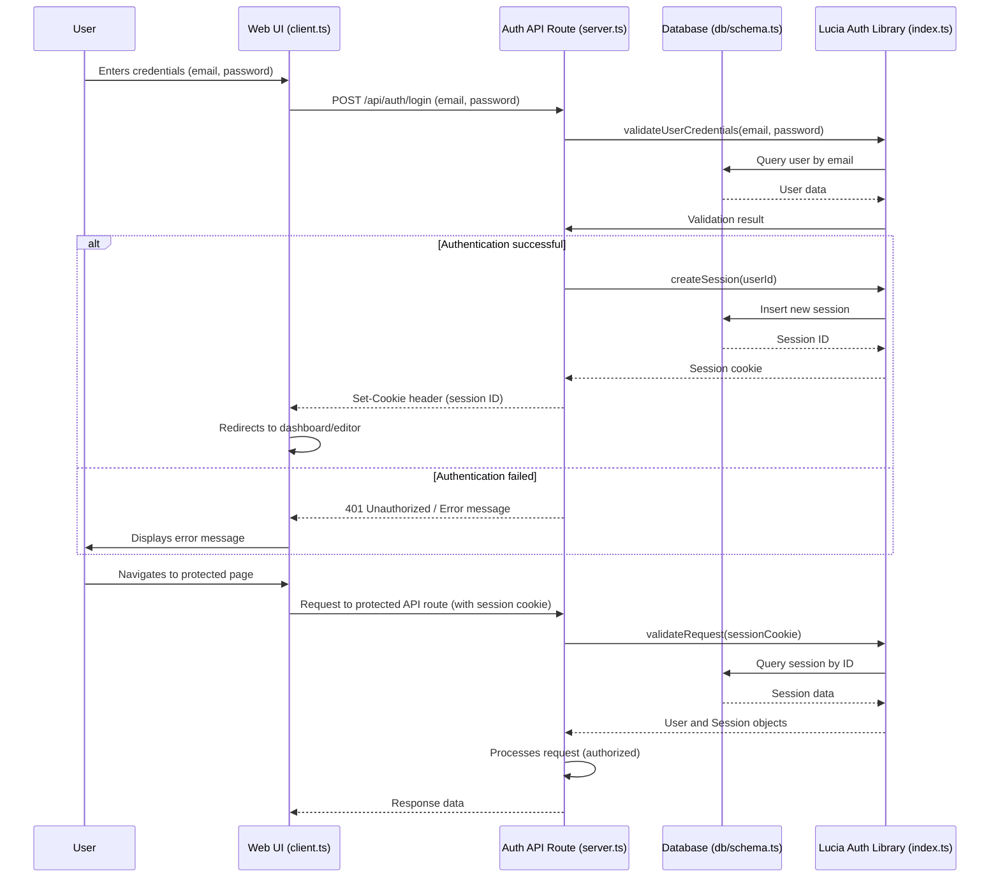

# Auth Package Documentation: `packages/auth/src/`

This document provides an overview of the authentication-related files within the `packages/auth/src/` directory. This package encapsulates the authentication logic for the OpenCut application, designed to be reusable across different parts of the system.

## Individual Files and Their Functionality

### `client.ts`

This file contains the client-side authentication logic. It typically includes functions and hooks that interact with the authentication API endpoints from the frontend. This might involve:
*   `useSession`: A React hook (or similar) to manage and provide the current user session state.
*   `signIn`: Function to handle user login requests.
*   `signUp`: Function to handle new user registration.
*   `signOut`: Function to handle user logout.

### `index.ts`

This file serves as the main entry point for the authentication package. It usually exports the core authentication setup and utilities that are shared between client and server-side logic, such as the Lucia authentication instance.

### `server.ts`

This file contains the server-side authentication logic. It is responsible for:
*   Validating user credentials.
*   Creating and managing user sessions.
*   Handling authentication-related API routes (e.g., `/api/auth/login`, `/api/auth/signup`).
*   Interacting with the database for user and session data.

## High-Level Workflow: User Authentication Flow

This diagram illustrates a typical user login process, showing the interaction between the client-side UI, the authentication API routes, and the database.

### `client.ts`

This file contains the client-side authentication logic. It typically includes functions and hooks that interact with the authentication API endpoints from the frontend. This might involve:
*   `useSession`: A React hook (or similar) to manage and provide the current user session state.
*   `signIn`: Function to handle user login requests.
*   `signUp`: Function to handle new user registration.
*   `signOut`: Function to handle user logout.

### `index.ts`

This file serves as the main entry point for the authentication package. It usually exports the core authentication setup and utilities that are shared between client and server-side logic, such as the Lucia authentication instance.

### `server.ts`

This file contains the server-side authentication logic. It is responsible for:
*   Validating user credentials.
*   Creating and managing user sessions.
*   Handling authentication-related API routes (e.g., `/api/auth/login`, `/api/auth/signup`).
*   Interacting with the database for user and session data.
