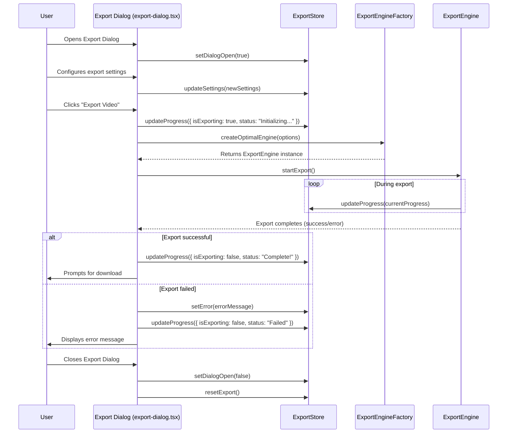

# Components Documentation: `apps/web/src/components/`

This document provides an overview of the reusable React components located in the `apps/web/src/components/` directory. These components are the building blocks of the user interface, designed for reusability and maintainability.

## Directories and Their Contents

### `editor/`

This directory contains components specifically designed for the video editor interface. These components are tightly coupled with the editor's functionality and UI layout.

### `landing/`

This directory houses components used for the application's landing pages, marketing content, and public-facing sections.

### `magicui/`

This directory likely contains custom or third-party UI components that provide unique visual effects or interactions, possibly for enhancing the user experience with "magic" or advanced UI elements.

### `ui/`

This directory contains generic, foundational UI components. These are typically atomic components (like buttons, inputs, dialogs, etc.) that are highly reusable across the entire application and often built on top of a UI library like Shadcn UI.

## Individual Component Files and Their Functionality

### High-Level Workflow: Export Dialog Interaction

This diagram illustrates the typical flow of interaction when a user uses the `export-dialog.tsx` component to initiate a video export.

### `background-settings.tsx`

A React component that provides controls for configuring the background settings of the project, such as background color or blur effects.

### `delete-project-dialog.tsx`

A dialog component that prompts the user for confirmation before deleting a project. It handles the UI for the confirmation message and the actions for confirming or canceling the deletion.

### `desktop-preferences.tsx`

A component for managing user preferences specific to the desktop (Electron) application, such as theme, auto-save settings, or default export quality.

### `development-debug.tsx`

A utility component used for debugging purposes during development. It might display internal state, logs, or provide quick actions for testing features.

### `editor-header.tsx`

The header component for the main editor view. It typically includes navigation elements, project-related controls (e.g., save, undo/redo), and other editor-specific actions.

### `editor-provider.tsx`

A React Context Provider component that likely provides editor-related state and functions to its children components, centralizing editor logic and data.

### `electron-error-boundary.tsx`

A React Error Boundary component specifically designed to catch and handle JavaScript errors within the Electron environment, preventing the entire application from crashing and providing a graceful fallback UI.

### `electron-hydration-fix.tsx`

A component or utility designed to address hydration mismatches that can occur in Next.js applications when running within an Electron environment, ensuring proper rendering.

### `electron-immediate-fix.tsx`

A component or utility that applies immediate fixes or workarounds for known issues or inconsistencies when the application runs in Electron.

### `electron-react-provider.tsx`

A React Context Provider that might bridge specific Electron APIs or functionalities to React components, making Electron-specific features accessible within the React component tree.

### `electron-router-wrapper.tsx`

A wrapper component that adapts or enhances the routing behavior for the Electron environment, potentially handling custom URL schemes or navigation patterns.

### `export-canvas.tsx`

A component that renders the canvas used for video export. It might manage the canvas element itself and provide an interface for drawing operations during the export process.

### `export-dialog.tsx`

A dialog component that allows users to configure video export settings (e.g., format, resolution, quality, filename) and initiate the export process.

### `floating-action-panel-demo.tsx`

A demonstration component for a floating action panel, showcasing its design and interactive behavior.

### `footer.tsx`

The footer component of the application, typically containing copyright information, links to privacy policy, terms of service, or social media.

### `header-base.tsx`

A foundational header component that provides common structure or styling for different header variations across the application.

### `header.tsx`

The main header component of the application, likely including navigation links, user authentication status, and other global UI elements.

### `icons.tsx`

A module that exports various SVG icons used throughout the application, providing a centralized and consistent way to manage and use icons.

### `project-creation-error-boundary.tsx`

A React Error Boundary component specifically for catching errors during the project creation process, providing a user-friendly message and preventing crashes.

### `rename-project-dialog.tsx`

A dialog component that allows users to rename an existing project. It handles input validation and the logic for updating the project name.

### `simple-dialog.tsx`

A generic, reusable dialog component that can be configured with a title, message, and custom buttons for various simple confirmation or informational prompts.

### `storage-debug.tsx`

A component used for debugging the application's storage mechanisms (e.g., IndexedDB, localStorage), allowing developers to inspect or manipulate stored data.

### `storage-provider.tsx`

A React Context Provider that makes the application's storage service (e.g., IndexedDB wrapper) available to child components, centralizing data persistence logic.

### `url-validation-provider.tsx`

A React Context Provider or component that integrates URL validation logic, potentially providing validated URLs or handling navigation based on validation results.

### `background-settings.tsx`

A React component that provides controls for configuring the background settings of the project, such as background color or blur effects.

### `delete-project-dialog.tsx`

A dialog component that prompts the user for confirmation before deleting a project. It handles the UI for the confirmation message and the actions for confirming or canceling the deletion.

### `desktop-preferences.tsx`

A component for managing user preferences specific to the desktop (Electron) application, such as theme, auto-save settings, or default export quality.

### `development-debug.tsx`

A utility component used for debugging purposes during development. It might display internal state, logs, or provide quick actions for testing features.

### `editor-header.tsx`

The header component for the main editor view. It typically includes navigation elements, project-related controls (e.g., save, undo/redo), and other editor-specific actions.

### `editor-provider.tsx`

A React Context Provider component that likely provides editor-related state and functions to its children components, centralizing editor logic and data.

### `electron-error-boundary.tsx`

A React Error Boundary component specifically designed to catch and handle JavaScript errors within the Electron environment, preventing the entire application from crashing and providing a graceful fallback UI.

### `electron-hydration-fix.tsx`

A component or utility designed to address hydration mismatches that can occur in Next.js applications when running within an Electron environment, ensuring proper rendering.

### `electron-immediate-fix.tsx`

A component or utility that applies immediate fixes or workarounds for known issues or inconsistencies when the application runs in Electron.

### `electron-react-provider.tsx`

A React Context Provider that might bridge specific Electron APIs or functionalities to React components, making Electron-specific features accessible within the React component tree.

### `electron-router-wrapper.tsx`

A wrapper component that adapts or enhances the routing behavior for the Electron environment, potentially handling custom URL schemes or navigation patterns.

### `export-canvas.tsx`

A component that renders the canvas used for video export. It might manage the canvas element itself and provide an interface for drawing operations during the export process.

### `export-dialog.tsx`

A dialog component that allows users to configure video export settings (e.g., format, resolution, quality, filename) and initiate the export process.

### `floating-action-panel-demo.tsx`

A demonstration component for a floating action panel, showcasing its design and interactive behavior.

### `footer.tsx`

The footer component of the application, typically containing copyright information, links to privacy policy, terms of service, or social media.

### `header-base.tsx`

A foundational header component that provides common structure or styling for different header variations across the application.

### `header.tsx`

The main header component of the application, likely including navigation links, user authentication status, and other global UI elements.

### `icons.tsx`

A module that exports various SVG icons used throughout the application, providing a centralized and consistent way to manage and use icons.

### `project-creation-error-boundary.tsx`

A React Error Boundary component specifically for catching errors during the project creation process, providing a user-friendly message and preventing crashes.

### `rename-project-dialog.tsx`

A dialog component that allows users to rename an existing project. It handles input validation and the logic for updating the project name.

### `simple-dialog.tsx`

A generic, reusable dialog component that can be configured with a title, message, and custom buttons for various simple confirmation or informational prompts.

### `storage-debug.tsx`

A component used for debugging the application's storage mechanisms (e.g., IndexedDB, localStorage), allowing developers to inspect or manipulate stored data.

### `storage-provider.tsx`

A React Context Provider that makes the application's storage service (e.g., IndexedDB wrapper) available to child components, centralizing data persistence logic.

### `url-validation-provider.tsx`

A React Context Provider or component that integrates URL validation logic, potentially providing validated URLs or handling navigation based on validation results.
