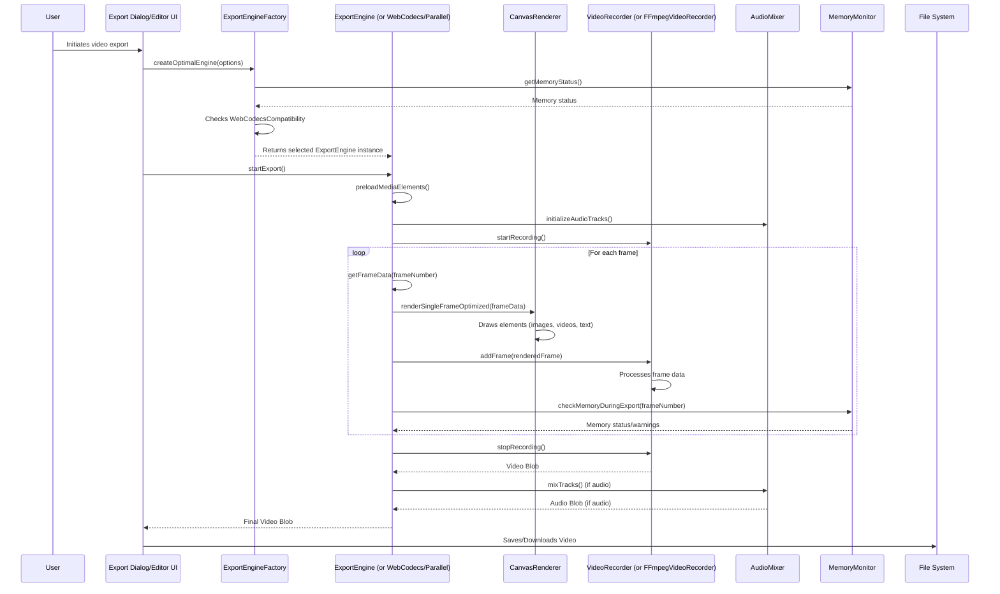

# Library Documentation: `apps/web/src/lib/`

This document provides an overview of the utility functions, helper modules, and service integrations located in the `apps/web/src/lib/` directory. These modules encapsulate reusable logic and interact with external services or browser APIs.

## High-Level Workflow: Video Export Process

The video export process is a complex workflow involving several key components and their interactions. The `ExportEngineFactory` plays a central role in selecting the most optimal export engine based on browser capabilities and system resources.

## Files and Their Functionality

### `ai-video-client.ts`

This module handles communication with the FAL.ai platform for AI video generation. It provides functions to:
*   `generateVideo`: Generate a video from a text prompt using various AI models (e.g., Seedance, Hailuo, Kling). It supports progress callbacks and handles queueing/polling for results.
*   `generateVideoFromImage`: Generate a video from an image input.
*   `getAvailableModels`: Retrieve a list of available AI video generation models with their details.
*   `estimateCost`: Estimate the cost of video generation based on model and duration.
*   `isApiAvailable`: Check if the FAL API key is configured.

### `audio-mixer.ts`

Provides functionalities for mixing multiple audio tracks into a single audio buffer. Key features include:
*   `AudioMixer` class: Manages audio tracks, loads audio buffers from files or URLs, and mixes them.
*   `addAudioTrack`: Adds an audio track with specified start/end times, volume, and pan.
*   `loadAudioBuffer`, `loadAudioBufferFromUrl`: Decodes audio files into `AudioBuffer` objects.
*   `mixTracks`: Combines all added audio tracks into a single `AudioBuffer`.
*   `exportAsWav`: Exports the mixed audio as a WAV Blob.

### `auth-wrapper.ts`

Offers a unified authentication interface that dynamically switches between server-side authentication (for web) and a simplified desktop authentication (for Electron).
*   `useSession`: A React hook that provides session data, adapting its behavior based on the environment.
*   `signIn`, `signUp`, `signOut`: Functions for authentication actions, with no-op implementations for desktop mode.

### `canvas-renderer.ts`

Encapsulates 2D canvas rendering operations, providing a simplified API for drawing images, text, and shapes.
*   `CanvasRenderer` class: Initializes a canvas context and provides methods like `clearFrame`, `drawImage`, `drawText`, `fillRect`, `drawRect`, `applyBlur`, and `toDataURL`.

### `debug-logger.ts`

A singleton class for persistent logging, primarily used for debugging issues that might cause page navigation or crashes. Logs are stored in `localStorage` and can be exported.
*   `debugLogger.log`: Records log entries with timestamps, component names, events, and associated data.
*   `debugLogger.getLogs`, `debugLogger.getFormattedLogs`: Retrieve and format stored logs.
*   `debugLogger.exportLogs`, `debugLogger.saveLogsToProject`: Export logs to a file.

### `desktop-auth.ts`

Manages a local, simplified user session for the Electron desktop application, bypassing traditional server authentication.
*   `getDesktopUser`: Creates or retrieves a persistent local user profile.
*   `updateDesktopUserPreferences`: Updates user settings stored locally.
*   `createDesktopSession`: Generates a mock session object for the desktop user.

### `electron-detection.ts`

Provides utilities to detect if the application is running within an Electron environment.
*   `isElectron`, `isDesktopMode`: Boolean functions to check the current environment.
*   `getEnvironmentInfo`: Returns detailed information about the runtime environment.

### `electron-font-fix.ts`

Addresses font loading issues in Electron static exports by dynamically converting absolute font paths to relative paths at runtime.
*   `fixElectronFontPaths`: Scans and modifies CSS `@font-face` rules and preload links.

### `electron-navigation.ts`

Offers navigation utilities specifically tailored for the Electron environment, using `window.location` for static page navigation instead of Next.js router.
*   `useElectronNavigation`: A hook providing a `navigateTo` function.
*   `useElectronLink`: A hook for `Link` components to handle navigation, including storage readiness checks.

### `electron-safe-fonts.ts`

Provides an alternative font loading approach for Electron to avoid absolute path issues with Next.js font optimization.
*   `getElectronSafeFont`: Returns a fallback font configuration for Electron.
*   `patchNextFontForElectron`: Overrides global CSS variables and `@font-face` rules for Electron compatibility.

### `electron-test.ts`

A utility to verify Electron integration and basic Inter-Process Communication (IPC).
*   `testElectronAPI`: Pings the Electron main process to confirm API availability.

### `export-engine-factory.ts`

A factory class responsible for selecting and creating the optimal video export engine based on browser capabilities, hardware acceleration, and memory constraints.
*   `createOptimalEngine`: Determines the best available engine (WebCodecs, parallel, or stable).
*   `createStableEngine`: Forces the use of the proven stable export engine.
*   `createParallelEngine`: Creates an engine utilizing parallel batch processing.
*   `createTestEngine`: Creates a WebCodecs engine for testing purposes.
*   `createEngineByPreference`: Allows forcing a specific engine type based on user preference.
*   `getEngineCapabilities`: Provides information about available export engines for UI display.
*   `validateExportSettings`: Checks export settings against memory limits.

### `export-engine-optimized.ts`

An optimized version of the video export engine, focusing on performance and memory efficiency. It includes:
*   Optimized frame rendering with batched canvas operations.
*   ImageBitmap and video frame caching for faster asset drawing.
*   Memory monitoring and graceful degradation.
*   Integration with `FFmpegVideoRecorder` for offline export.

### `export-engine.ts`

The base video export engine, providing core functionalities for rendering timeline elements to a canvas and recording the output.
*   `startExport`: Initiates the video export process, including preloading media, preparing audio, and rendering frames.
*   `cancelExport`: Stops the ongoing export.
*   `renderFrames`, `renderFramesOffline`: Methods for rendering frames, either directly to a MediaRecorder stream or for offline FFmpeg processing.
*   `renderSingleFrame`, `renderElement`: Functions for drawing individual frames and timeline elements.
*   `preloadVideos`: Preloads video assets to improve rendering performance.
*   `prepareAudioTracks`, `createAudioStream`: Handles audio mixing and streaming.
*   `startMemoryMonitoring`, `checkMemoryStatus`: Integrates with the memory monitor to prevent crashes.

### `export-errors.ts`

Defines custom error classes for various export-related issues and provides utilities for user-friendly error messages and logging.
*   `ExportError`, `MediaRecorderError`, `AudioMixerError`, `CanvasRenderError`, `TimelineError`, `BrowserCompatibilityError`, `MemoryError`: Specific error types.
*   `getUserFriendlyErrorMessage`: Maps technical errors to understandable messages for the user.
*   `logExportError`: Logs detailed error information for debugging.
*   `checkBrowserCompatibility`: Verifies browser support for necessary APIs.
*   `estimateMemoryUsage`: Provides a rough estimate of memory required for an export.

### `fal-ai-client.ts`

Client for interacting with FAL.ai's text-to-image generation API.
*   `FalAIClient` class: Manages API requests, handles different models (Imagen4, SeedDream, FLUX Pro), and processes responses.
*   `generateWithModel`, `generateWithMultipleModels`: Functions to generate images from text using single or multiple models.
*   `testModelAvailability`, `estimateGenerationTime`, `getModelCapabilities`: Utilities for model information and testing.
*   `batchGenerate`: Helper for processing multiple generation requests with concurrency and rate limiting.

### `fetch-github-stars.ts`

Fetches the number of stargazers for the OpenCut GitHub repository.
*   `getStars`: Retrieves the star count from the GitHub API, with caching and fallback mechanisms.

### `ffmpeg-utils.ts`

Provides a wrapper around `ffmpeg.wasm` for client-side video processing tasks.
*   `initFFmpeg`: Initializes the FFmpeg.wasm library.
*   `generateThumbnail`: Extracts a thumbnail image from a video file.
*   `trimVideo`: Trims a video file to a specified duration.
*   `getVideoInfo`: Extracts metadata (duration, dimensions, FPS) from a video file.
*   `convertToWebM`: Converts a video to WebM format.
*   `extractAudio`: Extracts audio from a video file.
*   `encodeImagesToVideo`: Encodes a sequence of images into a video.
*   `generateEnhancedThumbnails`: Generates multiple thumbnails from a video, with options for resolution, quality, and scene detection (using HTML5 Canvas or FFmpeg as fallback).

### `ffmpeg-video-recorder.ts`

An offline video recorder that uses `ffmpeg.wasm` to encode collected PNG frames into a video.
*   `FFmpegVideoRecorder` class: Collects image frames and uses FFmpeg to create a video blob.
*   `startRecording`, `addFrame`, `stopRecording`: Core recording methods.
*   `isFFmpegExportEnabled`: Checks if offline FFmpeg export is enabled via environment variables.

### `font-config.ts`

Configures and exports fonts for the Next.js application, including handling for Electron compatibility.
*   `FONT_CLASS_MAP`: Maps font names to their corresponding CSS class names.
*   `fonts`: Exports individual font objects.
*   `defaultFont`: Specifies the default font for the application.

### `frame-capture.ts`

Manages the process of capturing individual frames from the timeline for video export.
*   `FrameCaptureService` class: Calculates total frames, retrieves frame data (timestamp and visible elements), and provides an iterator for frames.
*   `extractVideoFrame`: Extracts a single frame from a video element onto a canvas.
*   `calculateElementBounds`: Determines the position and size of timeline elements on the canvas.
*   `isElementVisible`: Checks if a timeline element is active at a given timestamp.
*   `getVisibleElements`: Filters and sorts timeline elements visible at a specific time.

### `image-edit-client.ts`

Client for interacting with FAL.ai's image editing models (SeedEdit, FLUX Pro Kontext).
*   `uploadImageToFAL`: Uploads an image to FAL.ai (or converts to base64) for editing.
*   `editImage`: Sends an image editing request to FAL.ai, supporting progress callbacks and polling for results.
*   `getImageEditModels`: Retrieves information about available image editing models.

### `image-utils.ts`

Provides utility functions for image manipulation and information retrieval.
*   `getImageInfo`: Extracts dimensions, size, and aspect ratio from an image file.
*   `validateImageFile`: Checks file type and size against predefined limits.
*   `resizeImage`: Resizes an image while maintaining aspect ratio.
*   `imageToDataUrl`: Converts an image file to a data URL.
*   `downloadImage`: Downloads an image from a URL.
*   `formatFileSize`: Formats file size into a human-readable string.
*   `getDisplayDimensions`: Calculates optimal display dimensions for an image within a container.

### `media-processing.ts`

Handles the processing of media files (videos, images, audio) for use in the application.
*   `processMediaFiles`: Takes a list of files, determines their type, extracts metadata (duration, dimensions, thumbnails), and returns processed media items. It integrates with `ffmpeg-utils` for video processing.

### `memory-monitor-8gb.ts`

A specialized memory monitor designed to prevent memory exhaustion, particularly for large video processing tasks, with an assumed 8GB memory limit.
*   `MemoryMonitor8GB` class: Tracks current memory usage, provides status (low, medium, high, warning, critical), and recommends optimal export settings.
*   `shouldTriggerGC`, `isMemoryCritical`: Flags for memory pressure.
*   `optimizeMemoryUsage`, `emergencyCleanup`: Methods to free up memory (e.g., by forcing garbage collection or clearing caches).
*   `checkMemoryDuringExport`: Periodically checks memory during export.
*   `clearImageBitmapCache`, `clearVideoFrameCache`: Clears internal caches.

### `memory-monitor.ts`

A general-purpose memory monitor that tracks JavaScript heap usage and provides warnings or blocks operations if memory is insufficient.
*   `MemoryMonitor` class (singleton): Provides `getMemoryInfo`, `startMonitoring`, `stopMonitoring`, `checkFileSafety`, `getRecentWarnings`, `clearWarnings`, `getMemorySummary`, and `canPerformOperation`.
*   `estimateVideoMemoryUsage`: Estimates memory needed for video processing.
*   `getMemoryRecommendation`: Provides user-friendly recommendations based on file size.

### `metadata.ts`

Defines application-wide metadata for SEO and social media sharing.
*   `metadata`, `baseMetaData`: Objects containing title, description, Open Graph, Twitter, and icon configurations.

### `parallel-export-engine.ts`

Extends the `ExportEngine` to implement parallel batch processing for improved video export performance.
*   `ParallelExportEngine` class: Manages a pool of off-screen canvases for parallel rendering, buffers frames, and streams them to the recorder.
*   `calculateOptimalBatchSize`: Determines the ideal number of parallel canvases based on available memory.
*   `processFramesInParallel`: Orchestrates the parallel rendering and streaming of video frames.

### `rate-limit.ts`

Integrates with Upstash Redis for rate limiting, specifically used for the waitlist functionality.
*   `waitlistRateLimit`: A `Ratelimit` instance configured for 5 requests per minute.

### `streaming-recorder.ts`

A memory-efficient video recorder that streams frames directly to an encoder without keeping all frames in memory, designed for large video exports.
*   `StreamingRecorder` class: Uses `MediaRecorder` to capture canvas stream, manages memory with `MemoryMonitor8GB`, and adapts quality based on memory pressure.
*   `startRecording`, `addFrame`, `stopRecording`: Core recording methods.
*   `handleDataChunk`: Processes incoming video data chunks.
*   `adjustQualityForMemory`: Dynamically reduces bitrate if memory is low.

### `text2image-models.ts`

Defines a comprehensive list of text-to-image AI models available through FAL.ai, including their capabilities, costs, and recommended use cases.
*   `TEXT2IMAGE_MODELS`: A constant object containing detailed information for each model (e.g., Imagen4 Ultra, SeedDream v3, FLUX Pro v1.1 Ultra).
*   `getModelById`, `getModelsByProvider`, `getModelsByQuality`, `getModelsBySpeed`: Helper functions for filtering and retrieving model information.
*   `recommendModelsForPrompt`: Suggests models based on keywords in a text prompt.

### `thumbnail-cache.ts`

Manages a cache for video thumbnails to improve performance and reduce re-generation.
*   `ThumbnailCacheManager` class (singleton): Stores thumbnail URLs, manages cache size, and evicts least recently used items.
*   `cacheThumbnail`, `getThumbnail`, `getClosestThumbnail`: Methods for adding, retrieving, and finding thumbnails.
*   `clearVideoCache`, `clearAllCache`: Functions for clearing cached thumbnails.

### `time.ts`

Provides utility functions for formatting time codes.
*   `formatTimeCode`: Converts a time in seconds into various string formats (e.g., MM:SS, HH:MM:SS:CS).

### `url-validation-demo.ts`

A demo script to test the `url-validation.ts` module, showcasing its ability to validate and sanitize URLs.
*   `runUrlValidationDemo`: Executes a series of tests and logs the results to the console.

### `url-validation.ts`

Provides robust URL validation and sanitization specifically for `app://` protocol URLs used in Electron, addressing common malformed patterns.
*   `validateAppUrl`: Checks a URL for issues and optionally auto-fixes them.
*   `sanitizeAppUrl`: Returns a corrected URL.
*   `createUrlValidationMiddleware`: Creates a middleware function for URL validation.
*   `useUrlValidation`: A React hook for URL validation in components.
*   `patchLocationAssignment`: Attempts to patch `window.location` methods to automatically sanitize URLs.
*   `isValidElectronUrl`: Checks if a URL is valid for Electron navigation.
*   `validateUrlBatch`: Validates multiple URLs.
*   `enableUrlValidationDebug`: Enables debug logging for URL validation.

### `utils.ts`

Contains generic utility functions.
*   `cn`: A helper for conditionally joining Tailwind CSS classes.
*   `generateUUID`: Generates a UUID v4 string.
*   `getPlatformSpecialKey`: Returns the platform-specific special key modifier (Cmd for macOS, Ctrl for others).

### `video-recorder.ts`

Records video from a canvas element using the MediaRecorder API.
*   `VideoRecorder` class: Initializes `MediaRecorder`, handles data chunks, and provides methods for starting, pausing, resuming, and stopping recording.
*   `setAudioStream`: Allows adding an audio stream to the recording.
*   `getSupportedMimeType`: Determines the best supported video MIME type.
*   `getVideoBitrate`: Calculates video bitrate based on quality settings.

### `waitlist.ts`

Interacts with the database to manage a waitlist.
*   `getWaitlistCount`: Fetches the number of entries in the waitlist.

### `webcodecs-detector.ts`

Detects WebCodecs API compatibility and capabilities, including hardware acceleration support.
*   `WebCodecsCompatibility` class: Provides `checkSupport`, `shouldUseWebCodecs`, `safeWebCodecsCheck`, `getCapabilities`, `getStatusMessage`, `hasHardwareAcceleration`, and `getBestCodec`.

### `webcodecs-export-engine.ts`

Extends the `ExportEngine` to utilize the WebCodecs API for high-performance video encoding, with a fallback to the optimized engine if WebCodecs is not available or fails.
*   `WebCodecsExportEngine` class: Integrates with `VideoEncoder` and `mp4-muxer` (dynamically loaded) for efficient encoding.
*   `initialize`: Sets up WebCodecs components.
*   `renderAndEncodeFrame`: Renders a frame and encodes it using WebCodecs.
*   `finalize`: Completes the encoding process and returns the video blob.
*   `startExport`: Overrides the base export method to prioritize WebCodecs, with a robust fallback mechanism.

### `workspace-packages/db/index.ts`

Configures and exports Drizzle ORM instances for database interactions.
*   `migrationDb`: Database connection for migrations.
*   `db`: Database connection for queries, with schema loaded.

### `workspace-packages/db/schema.ts`

Defines the database schema using Drizzle ORM, including tables for users, sessions, projects, media items, and a waitlist.
*   `users`, `sessions`, `projects`, `mediaItems`, `waitlist`: Table definitions with their respective columns and relationships.

### `workspace-packages/auth/client.ts`

Client-side authentication functions and a React hook for managing user sessions.
*   `useSession`: React hook to get current user session data.
*   `signIn`, `signUp`, `signOut`: Functions for user authentication actions.

### `workspace-packages/auth/index.ts`

Configures and exports the Lucia authentication library.
*   `lucia`: The Lucia authentication instance, configured with DrizzlePostgreSQLAdapter.

### `workspace-packages/auth/server.ts`

Server-side authentication logic using Lucia, primarily for validating user requests and managing session cookies.
*   `validateRequest`: Validates the user's session from cookies.
