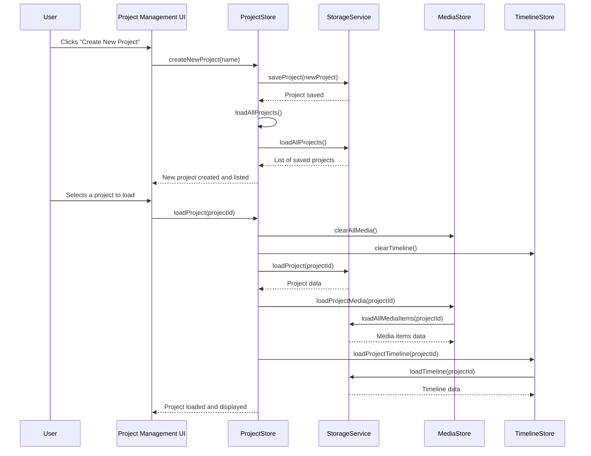

# Project Documentation: OpenCut

This document provides an overview of the OpenCut project's structure and the high-level functionality of its key components.

## 1. Project Structure

```
C:/Users/zdhpe/Desktop/New folder/OpenCut/
├───.github/
├───apps/
│   └───web/
│       ├───.claude/
│       ├───docs/
│       ├───e2e/
│       ├───electron/
│       ├───migrations/
│       ├───public/
│       ├───scripts/
│       ├───src/
│           ├───__tests__/
│           ├───app/
│               └───api/
│                   └───text2image/
│                       └───generate/
│                           └───route.ts
│           ├───app-backup/
│           ├───components/
│               ├───editor/
│               ├───landing/
│               ├───magicui/
│               ├───ui/
│               ├───background-settings.tsx
│               ├───delete-project-dialog.tsx
│               ├───desktop-preferences.tsx
│               ├───development-debug.tsx
│               ├───editor-header.tsx
│               ├───editor-provider.tsx
│               ├───electron-error-boundary.tsx
│               ├───electron-hydration-fix.tsx
│               ├───electron-immediate-fix.tsx
│               ├───electron-react-provider.tsx
│               ├───electron-router-wrapper.tsx
│               ├───export-canvas.tsx
│               ├───export-dialog.tsx
│               ├───floating-action-panel-demo.tsx
│               ├───footer.tsx
│               ├───header-base.tsx
│               ├───header.tsx
│               ├───icons.tsx
│               ├───project-creation-error-boundary.tsx
│               ├───rename-project-dialog.tsx
│               ├───simple-dialog.tsx
│               ├───storage-debug.tsx
│               ├───storage-provider.tsx
│               └───url-validation-provider.tsx
│           ├───constants/
│           ├───data/
│           ├───hooks/
│               ├───auth/
│               ├───use-aspect-ratio.ts
│               ├───use-drag-drop.ts
│               ├───use-keyboard-shortcuts-help.ts
│               ├───use-mobile.tsx
│               ├───use-playback-controls.ts
│               ├───use-selection-box.ts
│               ├───use-timeline-element-resize.ts
│               ├───use-timeline-playhead.ts
│               ├───use-timeline-zoom.ts
│               ├───use-toast.ts
│               ├───use-video-timeline-preview.ts
│               └───use-zip-export.ts
│           ├───lib/
│               ├───storage/
│               ├───workspace-packages/
│               ├───ai-video-client.ts
│               ├───audio-mixer.ts
│               ├───auth-wrapper.ts
│               ├───canvas-renderer.ts
│               ├───debug-logger.ts
│               ├───desktop-auth.ts
│               ├───electron-detection.ts
│               ├───electron-font-fix.ts
│               ├───electron-navigation.ts
│               ├───electron-safe-fonts.ts
│               ├───electron-test.ts
│               ├───export-engine-factory.ts
│               ├───export-engine-optimized.ts
│               ├───export-engine.ts
│               ├───export-errors.ts
│               ├───fal-ai-client.ts
│               ├───fetch-github-stars.ts
│               ├───ffmpeg-utils.ts
│               ├───ffmpeg-video-recorder.ts
│               ├───font-config.ts
│               ├───frame-capture.ts
│               ├───image-edit-client.ts
│               ├───image-utils.ts
│               ├───media-processing.ts
│               ├───memory-monitor-8gb.ts
│               ├───memory-monitor.ts
│               ├───metadata.ts
│               ├───parallel-export-engine.ts
│               ├───rate-limit.ts
│               ├───streaming-recorder.ts
│               ├───text2image-models.ts
│               ├───thumbnail-cache.ts
│               ├───time.ts
│               ├───url-validation-demo.ts
│               ├───url-validation.ts
│               ├───utils.ts
│               ├───video-recorder.ts
│               ├───waitlist.ts
│               ├───webcodecs-detector.ts
│               ├───webcodecs-export-engine.ts
│               └───zip-manager.ts
│           ├───pages/
│               ├───editor/
│               ├───_app.tsx
│               ├───_document.tsx
│               ├───contributors.tsx
│               ├───index.tsx
│               ├───login.tsx
│               ├───privacy.tsx
│               ├───projects.tsx
│               ├───signup.tsx
│               └───why-not-capcut.tsx
│           ├───stores/
│               ├───adjustment-store.ts
│               ├───editor-store.ts
│               ├───export-store.ts
│               ├───keybindings-store.ts
│               ├───media-store.ts
│               ├───panel-store.ts
│               ├───playback-store.ts
│               ├───project-store.ts
│               ├───text2image-store.ts
│               └───timeline-store.ts
│           ├───styles/
│           ├───types/
│           └───middleware.ts.disabled
│       ├───.env.example
│       ├───.gitignore
│       ├───.npmrc
│       ├───components.json
│       ├───Dockerfile
│       ├───drizzle.config.ts
│       ├───ELECTRON_NAVIGATION_FIX.md
│       ├───electron-app.html
│       ├───electron-with-logs.ps1
│       ├───jest.config.js
│       ├───jest.setup.js
│       ├───next.config.electron.ts
│       ├───next.config.js
│       ├───next.config.ts
│       ├───package-electron.json
│       ├───package.json
│       ├───package.json.backup
│       ├───playwright.config.ts
│       ├───postcss.config.mjs
│       ├───run-e2e-tests.bat
│       ├───run-electron-with-logs.bat
│       ├───tailwind.config.ts
│       ├───test-electron.js
│       └───tsconfig.json
└───packages/
    ├───auth/
│       ├───src/
│           ├───client.ts
│           ├───index.ts
│           └───server.ts
│       └───package.json
    └───db/
│       ├───migrations/
│       ├───src/
│       ├───drizzle.config.ts
│       └───package.json
```

## 2. File Purpose and High-Level Functionality

### High-Level Workflow: Project Creation and Loading

This diagram illustrates the sequence of function calls when a new project is created and subsequently loaded in the application.



### `apps/web/src/app/api/text2image/generate/route.ts`

This file likely defines an API route for generating images from text. It would handle incoming requests, process the text input, interact with an image generation service or library, and return the generated image or a reference to it.

### `apps/web/src/app/api/text2image/generate/route.ts`

This file likely defines an API route for generating images from text. It would handle incoming requests, process the text input, interact with an image generation service or library, and return the generated image or a reference to it.

### `apps/web/src/components/`

This directory contains reusable UI components used throughout the web application.

#### `apps/web/src/components/editor/`

Contains components specific to the video editor interface.

#### `apps/web/src/components/ui/`

Houses generic, foundational UI components (e.g., buttons, inputs, dialogs) often built using a UI library like Shadcn UI.

#### `apps/web/src/components/export-dialog.tsx`

Manages the user interface and logic for the video export dialog, allowing users to configure export settings (e.g., format, quality) before initiating the video rendering process.

#### `apps/web/src/components/editor-header.tsx`

Defines the header component for the editor view, typically containing navigation, project controls, and other editor-specific actions.

#### `apps/web/src/components/delete-project-dialog.tsx`

Provides a confirmation dialog for deleting projects, ensuring user intent before irreversible actions.

#### `apps/web/src/components/electron-error-boundary.tsx`

A React Error Boundary component specifically designed to catch and handle errors within the Electron environment, providing a fallback UI and logging errors.

#### `apps/web/src/components/storage-provider.tsx`

Likely a React Context Provider that manages and provides access to local storage or IndexedDB for persistent data storage within the application.

### `apps/web/src/hooks/`

This directory contains custom React hooks that encapsulate reusable stateful logic.

#### `apps/web/src/hooks/use-drag-drop.ts`

A custom hook for implementing drag-and-drop functionality within the application, handling events and state related to dragging and dropping elements.

#### `apps/web/src/hooks/use-timeline-playhead.ts`

Manages the state and logic for the video timeline's playhead, including its position, movement, and synchronization with video playback.

#### `apps/web/src/hooks/use-zip-export.ts`

Handles the logic for exporting project data or media as a ZIP archive, potentially including file compression and download initiation.

### `apps/web/src/lib/`

This directory contains utility functions, helper modules, and service integrations used across the application.

#### `apps/web/src/lib/ffmpeg-utils.ts`

Provides utility functions for interacting with FFmpeg, likely for video processing tasks such as transcoding, frame extraction, or audio manipulation.

#### `apps/web/src/lib/export-engine.ts`

Defines the core logic for the video export process, orchestrating various steps like rendering, encoding, and file output.

#### `apps/web/src/lib/electron-navigation.ts`

Contains functions and logic related to navigation within the Electron desktop application, potentially handling deep linking or inter-process communication for routing.

#### `apps/web/src/lib/zip-manager.ts`

Manages the creation and manipulation of ZIP archives, used for tasks like exporting project files or bundling assets.

#### `apps/web/src/lib/media-processing.ts`

Likely contains functions for various media-related operations, such as loading, decoding, or transforming audio and video data.

### `apps/web/src/pages/`

This directory contains the Next.js page components, defining the different routes and views of the web application.

#### `apps/web/src/pages/index.tsx`

The main landing page or home page of the application.

#### `apps/web/src/pages/projects.tsx`

Displays a list of user projects and provides an interface for managing them.

#### `apps/web/src/pages/editor/`

Contains the main editor page and its sub-routes.

#### `apps/web/src/pages/login.tsx`

Handles user authentication and login functionality.

#### `apps/web/src/pages/signup.tsx`

Provides the user registration and account creation interface.

### `apps/web/src/stores/`

This directory contains Zustand (or similar state management library) stores that manage the application's global state.

#### `apps/web/src/stores/editor-store.ts`

Manages the state related to the video editor, including the current project, timeline data, and active tools.

#### `apps/web/src/stores/media-store.ts`

Handles the state and operations related to media assets (videos, images, audio) within the application, such as loading, managing, and accessing media files.

#### `apps/web/src/stores/project-store.ts`

Manages the state of user projects, including creating, loading, saving, and deleting projects.

#### `apps/web/src/stores/timeline-store.ts`

Controls the state of the video timeline, including tracks, clips, and their properties.

#### `apps/web/src/stores/export-store.ts`

Manages the state of the video export process, including export settings, progress, and status.

### `packages/auth/`

This package provides authentication functionalities for the OpenCut application.

#### `packages/auth/src/index.ts`

Serves as the main entry point for the authentication package, likely exporting common authentication utilities and types.

#### `packages/auth/src/client.ts`

Contains client-side authentication logic, such as functions for user login, logout, and session management in the browser or Electron renderer process.

#### `packages/auth/src/server.ts`

Implements server-side authentication logic, including API routes for authentication, user registration, and session validation.

### `packages/db/`

This package manages database interactions and schema for the OpenCut application, utilizing Drizzle ORM.

#### `packages/db/drizzle.config.ts`

Configuration file for Drizzle Kit, defining database connection details and schema paths for migrations.

#### `packages/db/migrations/`

Contains SQL migration files generated by Drizzle Kit, used to evolve the database schema over time.