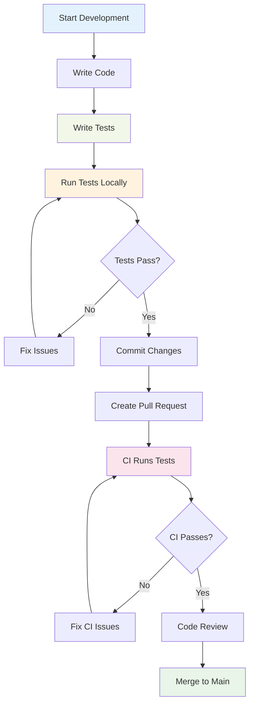

# OpenCut Testing Setup

This directory contains the testing infrastructure and utilities for the OpenCut video editor.

## Directory Structure

```
src/test/
├── README.md           # This file - testing documentation
├── setup.ts           # Test environment setup and global mocks
├── utils.tsx          # Custom testing utilities and helpers
└── examples/          # Example test files for contributors
    ├── button.test.tsx           # UI component testing examples
    └── use-video-editor.test.ts  # Custom hook testing examples
```

## Quick Start

### Testing Workflow



### 1. Install Testing Dependencies

```bash
cd apps/web
bun add -d vitest @testing-library/react @testing-library/jest-dom @testing-library/user-event jsdom
```

### 2. Add Test Scripts to package.json

```json
{
  "scripts": {
    "test": "vitest",
    "test:ui": "vitest --ui",
    "test:watch": "vitest --watch",
    "test:coverage": "vitest --coverage"
  }
}
```

### 3. Run Tests

```bash
# Run all tests
bun test

# Run tests in watch mode
bun test --watch

# Run specific test file
bun test button.test.tsx

# Run tests with UI
bun test:ui
```

## Testing Utilities

### Custom Render Function

Use the custom `render` function from `./utils.tsx` instead of the default one:

```typescript
import { render, screen } from '../test/utils'

// This automatically wraps components with necessary providers
render(<YourComponent />)
```

### Mock File Creation

Create mock files for testing video/audio upload functionality:

```typescript
import { createMockVideoFile, createMockAudioFile } from '../test/utils'

const videoFile = createMockVideoFile('test.mp4', 1024 * 1024) // 1MB
const audioFile = createMockAudioFile('test.mp3', 512 * 1024)  // 512KB
```

### Timeline Testing Utilities

Create mock timeline data for editor tests:

```typescript
import { createMockTimelineTrack, createMockVideoClip } from '../test/utils'

const track = createMockTimelineTrack('track-1', 'video')
const clip = createMockVideoClip('clip-1', 0, 5) // 5 second clip starting at 0
```

## What to Test

### Priority Areas

1. **Core Video Editor Functions**
   - Timeline manipulation
   - Video/audio track management
   - Export functionality
   - File upload/import

2. **UI Components**
   - Button interactions
   - Modal dialogs
   - Form validations
   - Drag and drop functionality

3. **Custom Hooks**
   - Video processing hooks
   - State management hooks
   - File handling hooks

4. **Utility Functions**
   - Video format conversions
   - Time calculations
   - File size validations

### Testing Patterns

#### Component Testing
```typescript
describe('ComponentName', () => {
  it('renders correctly', () => {
    render(<ComponentName />)
    expect(screen.getByRole('button')).toBeInTheDocument()
  })

  it('handles user interactions', async () => {
    const user = userEvent.setup()
    const handleClick = vi.fn()
    
    render(<ComponentName onClick={handleClick} />)
    await user.click(screen.getByRole('button'))
    
    expect(handleClick).toHaveBeenCalled()
  })
})
```

#### Hook Testing
```typescript
describe('useCustomHook', () => {
  it('returns expected initial state', () => {
    const { result } = renderHook(() => useCustomHook())
    expect(result.current.value).toBe(expectedValue)
  })

  it('updates state correctly', () => {
    const { result } = renderHook(() => useCustomHook())
    
    act(() => {
      result.current.updateValue(newValue)
    })
    
    expect(result.current.value).toBe(newValue)
  })
})
```

## Available Mocks

### Global Mocks (setup.ts)

- **Next.js Router** - `useRouter`, `useSearchParams`, `usePathname`
- **FFmpeg** - Video processing operations
- **File API** - File upload and handling
- **Media Elements** - Video/audio play, pause, load
- **Canvas API** - Video frame processing
- **ResizeObserver** - Component resize detection
- **IntersectionObserver** - Element visibility detection

### Utility Mocks (utils.tsx)

- **Video/Audio Files** - Mock file creation
- **Timeline Data** - Mock tracks and clips
- **Drag & Drop Events** - Mock drag/drop interactions
- **Keyboard Events** - Mock keyboard navigation
- **Canvas Context** - Mock 2D rendering context
- **Local Storage** - Mock browser storage

## Writing Good Tests

### Best Practices

1. **Descriptive Test Names**
   ```typescript
   // ✅ Good
   it('shows error message when video file is too large')
   
   // ❌ Bad
   it('handles error')
   ```

2. **Test User Behavior, Not Implementation**
   ```typescript
   // ✅ Good - tests what user sees
   expect(screen.getByText('Video uploaded successfully')).toBeInTheDocument()
   
   // ❌ Bad - tests implementation details
   expect(component.state.uploadStatus).toBe('success')
   ```

3. **Use Proper Assertions**
   ```typescript
   // ✅ Good - specific assertion
   expect(screen.getByRole('button')).toBeDisabled()
   
   // ❌ Bad - generic assertion
   expect(screen.getByRole('button')).toBeTruthy()
   ```

4. **Clean Up After Tests**
   ```typescript
   afterEach(() => {
     vi.clearAllMocks()
     cleanup()
   })
   ```

### Common Patterns

#### Testing Async Operations
```typescript
it('handles video upload', async () => {
  const user = userEvent.setup()
  render(<VideoUploader />)
  
  const file = createMockVideoFile()
  const input = screen.getByLabelText(/upload video/i)
  
  await user.upload(input, file)
  
  expect(await screen.findByText('Upload complete')).toBeInTheDocument()
})
```

#### Testing Error States
```typescript
it('shows error when upload fails', async () => {
  const mockUpload = vi.fn().mockRejectedValue(new Error('Upload failed'))
  
  render(<VideoUploader onUpload={mockUpload} />)
  
  // Trigger upload...
  
  expect(await screen.findByText('Upload failed')).toBeInTheDocument()
})
```

## Debugging Tests

### Common Issues

1. **Component Not Found**
   - Check if component is properly rendered
   - Verify test queries match actual DOM structure
   - Use `screen.debug()` to see rendered output

2. **Async Operations**
   - Use `findBy*` queries for async content
   - Wait for operations with `waitFor()`
   - Mock async dependencies properly

3. **Mock Issues**
   - Clear mocks between tests with `vi.clearAllMocks()`
   - Verify mock implementations match expected interface
   - Check mock call counts and arguments

### Debugging Tools

```typescript
// See what's rendered
screen.debug()

// See specific element
screen.debug(screen.getByRole('button'))

// Log all queries
screen.logTestingPlaygroundURL()
```

## Resources

- [Vitest Documentation](https://vitest.dev/)
- [Testing Library Docs](https://testing-library.com/docs/react-testing-library/intro/)
- [Jest DOM Matchers](https://github.com/testing-library/jest-dom)
- [User Event API](https://testing-library.com/docs/user-event/intro/)

## Contributing

When adding new test utilities or examples:

1. Add them to the appropriate file (`setup.ts`, `utils.tsx`, or `examples/`)
2. Document the utility with JSDoc comments
3. Add usage examples in this README
4. Update the CONTRIBUTING.md file if needed

Happy testing!
