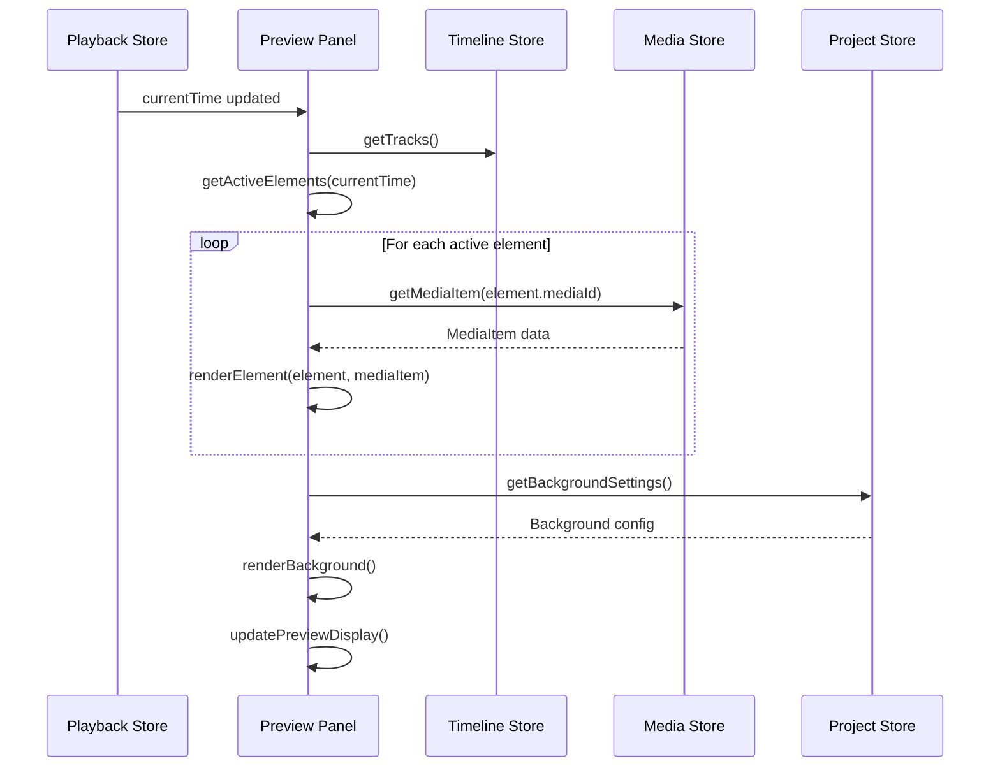

# Preview Panel Component Documentation

## Overview
The `PreviewPanel` component is the central video preview display in OpenCut's editor. It renders the visual composition of timeline elements in real-time, showing how the final video will look at the current playback position.

**File Location**: `apps/web/src/components/editor/preview-panel.tsx`

## Key Features

### 🎬 Real-time Preview Rendering
- Displays active timeline elements at current playback time
- Supports multiple media types: video, image, audio, and text
- Maintains proper aspect ratio and scaling
- Responsive preview sizing that fits container

### 🎨 Background System
- **Solid Color**: Configurable background color
- **Blur Background**: Uses first video/image element as blurred background
- Dynamic background switching based on project settings

### 📐 Adaptive Sizing
- Calculates optimal preview dimensions automatically
- Maintains canvas aspect ratio within available space
- Accounts for container padding, gaps, and toolbar height
- Uses ResizeObserver for responsive updates

## Architecture

### Preview Panel State Flow

This diagram shows the data flow and function calls within the Preview Panel component:



### State Management
The component integrates with multiple Zustand stores:

```typescript
// Core timeline data
const { tracks } = useTimelineStore();
const { mediaItems } = useMediaStore(); 
const { currentTime } = usePlaybackStore();
const { canvasSize } = useEditorStore();
const { activeProject } = useProjectStore();
```

### Element Rendering System

#### Active Element Detection
```typescript
const getActiveElements = (): ActiveElement[] => {
  // Finds all timeline elements visible at currentTime
  // Considers: startTime, duration, trimStart, trimEnd
}
```

#### Rendering Pipeline
1. **Background Layer**: Blur effect or solid color
2. **Media Elements**: Videos, images (layered by track order)  
3. **Text Elements**: Positioned text with styling (top layer)
4. **Audio Elements**: Hidden but processed for playback

### Text Element Rendering
- Font family mapping via `FONT_CLASS_MAP`
- Positioned using absolute coordinates
- Supports: rotation, opacity, color, alignment
- Scaling based on preview dimensions vs canvas size

### Media Element Types

#### Video Elements
```typescript
<VideoPlayer
  src={mediaItem.url}
  clipStartTime={element.startTime}
  trimStart={element.trimStart}
  trimEnd={element.trimEnd}
  clipDuration={element.duration}
/>
```

#### Image Elements
```typescript

```

#### Test Elements
- Placeholder display for development/testing
- Shows gradient background with emoji icon

## Preview Toolbar Component

### Playback Controls
- Play/Pause button with hover animations
- Disabled when no timeline elements exist
- Smooth scaling and color transitions

### Time Display
```typescript
<span className="tabular-nums" style={{ color: '#05c7c7' }}>
  {formatTimeCode(currentTime, "HH:MM:SS:FF", fps)}
</span>
```

### Aspect Ratio Controls
- Dropdown menu for canvas size presets
- "Original" option to match source media
- Real-time preview updates when changed

### Background Settings
- Integrated `BackgroundSettings` component
- Controls blur intensity and background type

## Performance Optimizations

### Resize Handling
```typescript
const resizeObserver = new ResizeObserver(updatePreviewSize);
// Efficient container size monitoring
```

### Element Filtering
- Only renders elements active at current time
- Separate filtering for blur background elements
- Minimal re-renders through proper state management

## Styling & Visual Design

### Container Styling
```typescript
style={{
  borderTop: '2px solid #ff6b6b',
  borderRight: '2px solid #4ecdc4', 
  borderBottom: '2px solid #45b7d1',
  borderLeft: '2px solid #96ceb4'
}}
```

### Responsive Layout
- Flexbox layout with proper min-height/width constraints
- Centered preview with flexible spacing
- Toolbar positioned at bottom

## Error Handling & Edge Cases

### Empty States
- "No media added to timeline" when no elements exist
- "No elements at current time" for empty time positions
- Blur background fallback messages

### Media Loading
- Graceful handling of missing media items
- Test element fallbacks for development
- Poster images for video loading states

## Dependencies

### External Libraries
- `lucide-react`: Icons (Play, Pause, Expand)
- Zustand stores for state management
- Custom UI components (Button, DropdownMenu)

### Internal Utilities
- `formatTimeCode`: Time display formatting  
- `cn`: Tailwind class merging
- `FONT_CLASS_MAP`: Font family mapping
- `useAspectRatio`: Aspect ratio calculations

## Integration Points

### Timeline Synchronization
- Listens to `currentTime` from playback store
- Updates preview in real-time during playback
- Maintains sync with timeline scrubbing

### Export Pipeline
- Preview rendering mirrors export output
- Canvas dimensions match export settings
- Element positioning consistent across preview/export

### Media Management
- Integrates with media store for file URLs
- Handles different media types consistently
- Supports trimming and timing adjustments

## Future Enhancements

### Potential Improvements
- Multi-element blur backgrounds
- Advanced text styling options
- Preview quality settings
- Fullscreen preview mode
- Element selection/highlighting
- Preview annotations/guides

### Performance Opportunities  
- Virtual rendering for complex timelines
- Canvas-based rendering for better performance
- WebGL acceleration for effects
- Background rendering optimization