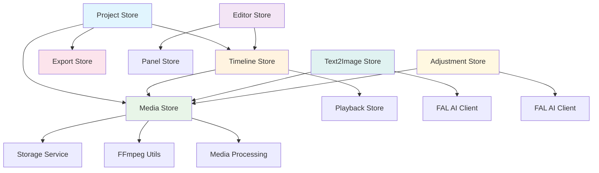
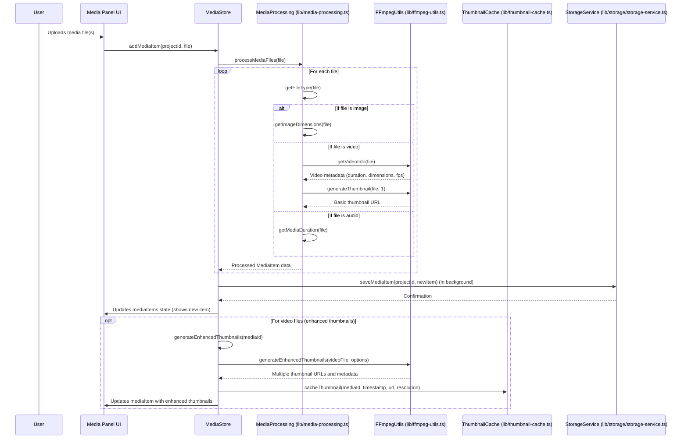
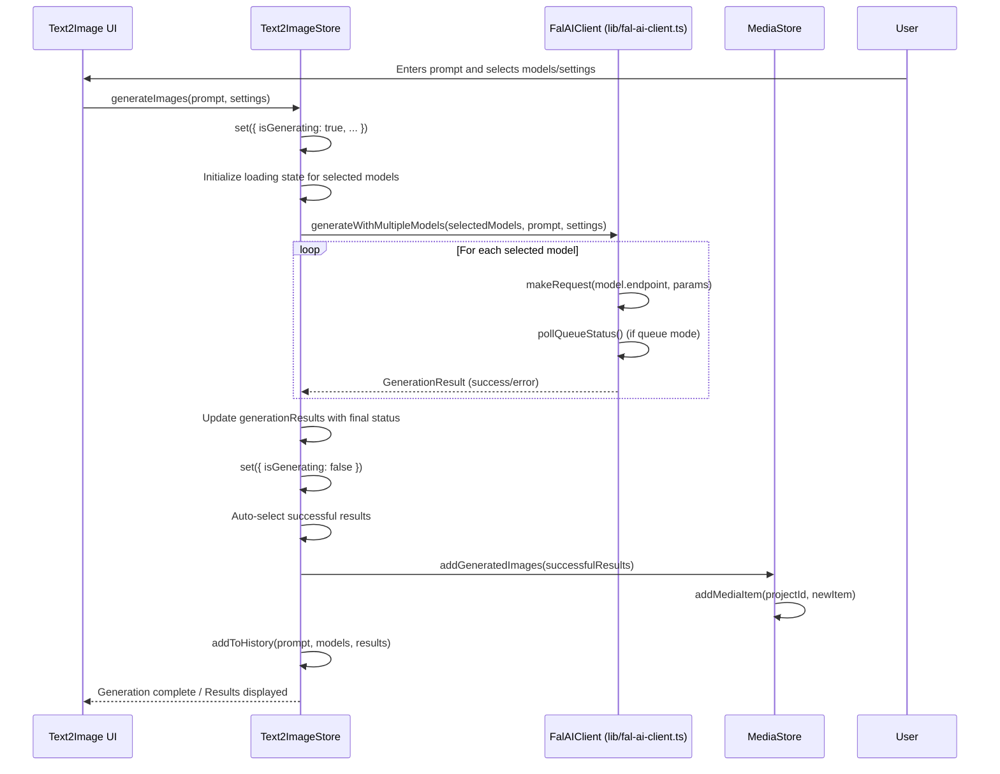

# Stores Documentation: `apps/web/src/stores/`

This document provides an overview of the Zustand stores used for state management within the OpenCut web application. Each store manages a specific part of the application's global state and provides actions to modify that state.

## Stores and Their Functionality

### `adjustment-store.ts`

Manages the state for image adjustment and editing features, including the original and edited images, selected AI models, parameters for image generation, and an edit history.

*   **State:** `originalImage`, `originalImageUrl`, `currentEditedUrl`, `selectedModel`, `prompt`, `parameters`, `editHistory`, `currentHistoryIndex`, `isProcessing`, `progress`, `statusMessage`, `elapsedTime`, `estimatedTime`, `showParameters`, `showHistory`, `previewMode`.
*   **Actions:** `setOriginalImage`, `clearImage`, `setSelectedModel`, `setPrompt`, `updateParameter`, `resetParameters`, `addToHistory`, `goToHistoryItem`, `canUndo`, `canRedo`, `undo`, `redo`, `clearHistory`, `setProcessingState`, `toggleParameters`, `toggleHistory`, `setPreviewMode`.

### `editor-store.ts`

Manages the global state related to the video editor interface, including initialization status and canvas settings.

*   **State:** `isInitializing`, `isPanelsReady`, `canvasSize`, `canvasMode`, `canvasPresets`.
*   **Actions:** `setInitializing`, `setPanelsReady`, `initializeApp`, `setCanvasSize`, `setCanvasSizeToOriginal`, `setCanvasSizeFromAspectRatio`.

### `export-store.ts`

Manages the state and settings for the video export process, including export configuration, progress, and error handling.

*   **State:** `settings` (format, quality, filename, dimensions), `progress` (isExporting, progress percentage, frame counts, status), `error`, `isDialogOpen`.
*   **Actions:** `updateSettings`, `updateProgress`, `setError`, `setDialogOpen`, `resetExport`.

### `keybindings-store.ts`

Manages application-wide keyboard shortcuts and their associated actions.

*   **State:** `keybindings` (a map of key combinations to actions).
*   **Actions:** `updateKeybinding`, `removeKeybinding`, `getKeybindingString` (converts KeyboardEvent to a key string), `validateKeybinding`, `getKeybindingsForAction`.

## Store Interactions Overview

This diagram shows how the different Zustand stores interact with each other and external services:

### `media-store.ts`

This Zustand store is responsible for **managing all media assets** (images, videos, and audio) within the OpenCut application. It acts as the central source of truth for media items, handling their loading, processing, metadata extraction, and persistence. It also integrates with external utilities for advanced media operations like thumbnail and timeline preview generation.

**Key Responsibilities:**
*   **Media Item Management:** Stores, adds, removes, and updates `MediaItem` objects, which encapsulate file data, URLs, and metadata.
*   **Persistence Integration:** Collaborates with `storageService` (from `lib/storage/storage-service.ts`) to load and save media items to persistent storage (e.g., IndexedDB), ensuring data is retained across sessions.
*   **Media Processing:** Orchestrates the initial processing of uploaded files, including determining file types, extracting dimensions, duration, and generating basic thumbnails using `media-processing.ts` and `ffmpeg-utils.ts`.
*   **Enhanced Thumbnail Generation:** Manages the generation of multiple, high-quality thumbnails for video scrubbing, leveraging `ffmpeg-utils.ts` and `thumbnail-cache.ts` for efficiency.
*   **Timeline Preview Generation:** Creates optimized sets of thumbnails specifically for the timeline's visual previews, adapting to zoom levels and element durations.
*   **State Tracking:** Provides detailed status updates for media processing (e.g., `processingStage`), allowing the UI to reflect the current state of media items.

**Core Actions:**
*   `addMediaItem(projectId, item)`: Adds a new media item to the store and saves it to persistent storage. It triggers initial processing for metadata extraction and basic thumbnail generation.
*   `removeMediaItem(projectId, id)`: Deletes a media item from the store and persistent storage, also revoking object URLs to prevent memory leaks.
*   `loadProjectMedia(projectId)`: Loads all media items associated with a specific project from storage.
*   `addGeneratedImages(items)`: Specifically handles adding images generated by AI (e.g., from `text2image-store`) to the media library.
*   `generateEnhancedThumbnails(mediaId, options)`: Initiates the process of creating multiple, high-resolution thumbnails for a video, often used for scrubbing previews.
*   `getThumbnailAtTime(mediaId, timestamp)`: Retrieves the most appropriate thumbnail for a given media item at a specific time.
*   `generateTimelinePreviews(mediaId, options)`: Generates a strip of thumbnails optimized for display on the timeline, considering density and zoom levels.
*   `isMediaItemReady(id)`: Checks if a media item has completed all necessary processing and is ready for use in the editor.

#### High-Level Workflow: Media Item Processing

This diagram illustrates the typical flow when a user adds a new media file to the application, including initial processing and thumbnail generation.

### `panel-store.ts`

Manages the sizes and states of various UI panels within the editor, persisting these settings across sessions.

*   **State:** `toolsPanel`, `previewPanel`, `propertiesPanel`, `mainContent`, `timeline`, `mainContentHeight`, `timelineHeight` (all as percentages).
*   **Actions:** `setToolsPanel`, `setPreviewPanel`, `setPropertiesPanel`, `setMainContent`, `setTimeline`, `setMainContentHeight`, `setTimelineHeight`.

### `playback-store.ts`

Controls the playback state of the video timeline, including play/pause, current time, duration, volume, and speed.

*   **State:** `isPlaying`, `currentTime`, `duration`, `volume`, `muted`, `previousVolume`, `speed`.
*   **Actions:** `play`, `pause`, `toggle`, `seek`, `setVolume`, `setSpeed`, `setDuration`, `setCurrentTime`, `mute`, `unmute`, `toggleMute`.

### `project-store.ts`

Manages the active project, a list of all saved projects, and provides actions for project creation, loading, saving, deletion, and duplication. It also handles project-level settings like background and FPS.

*   **State:** `activeProject`, `savedProjects`, `isLoading`, `isInitialized`.
*   **Actions:** `createNewProject`, `loadProject`, `saveCurrentProject`, `loadAllProjects`, `deleteProject`, `closeProject`, `renameProject`, `duplicateProject`, `updateProjectBackground`, `updateBackgroundType`, `updateProjectFps`.

### `text2image-store.ts`

Manages the state for text-to-image generation, including the prompt, selected AI models, generation results, and a history of past generations.

*   **State:** `prompt`, `selectedModels`, `generationMode`, `isGenerating`, `generationResults`, `selectedResults`, `generationHistory`.
*   **Actions:** `setPrompt`, `toggleModel`, `clearModelSelection`, `setGenerationMode`, `generateImages`, `addSelectedToMedia`, `clearResults`, `addToHistory`.

#### Detailed Workflow: Text-to-Image Generation

This diagram illustrates the sequence of function calls when a user initiates text-to-image generation, including interaction with the FAL.ai client and media store.

