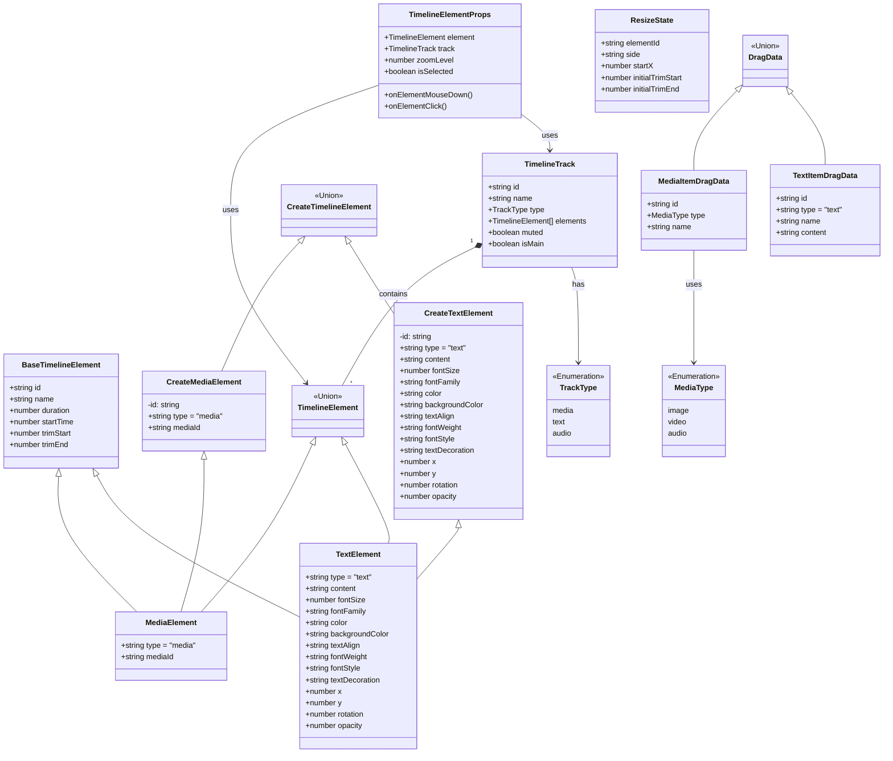

# Types Documentation: `apps/web/src/types/`

This document outlines the core TypeScript type definitions used across the OpenCut web application. These types ensure data consistency and provide clear contracts for various components, stores, and services.

## Core Type Architecture Overview

This diagram shows the relationships between the main type definitions and how they interact across the application:

```mermaid
classDiagram
    class TProject {
        +string id
        +string name
        +string thumbnail
        +Date createdAt
        +Date updatedAt
        +MediaItem[] mediaItems
        +string backgroundColor
        +BackgroundType backgroundType
        +number blurIntensity
        +number fps
    }

    class MediaItem {
        +string id
        +string name
        +MediaType type
        +string url
        +number duration
        +number width
        +number height
        +string thumbnail
    }

    class TimelineTrack {
        +string id
        +string name
        +TrackType type
        +TimelineElement[] elements
        +boolean muted
        +boolean isMain
    }

    class TimelineElement {
        <<interface>>
        +string id
        +string name
        +number duration
        +number startTime
        +number trimStart
        +number trimEnd
    }

    class MediaElement {
        +string type = "media"
        +string mediaId
    }

    class TextElement {
        +string type = "text"
        +string content
        +number fontSize
        +string fontFamily
        +string color
        +number x
        +number y
        +number rotation
        +number opacity
    }

    class ExportSettings {
        +ExportFormat format
        +ExportQuality quality
        +string filename
        +number width
        +number height
    }

    class PlaybackState {
        +boolean isPlaying
        +number currentTime
        +number duration
        +number volume
        +number speed
        +boolean muted
    }

    TProject ||--o{ MediaItem : contains
    TProject ||--o{ TimelineTrack : has
    TimelineTrack ||--o{ TimelineElement : contains
    TimelineElement <|-- MediaElement
    TimelineElement <|-- TextElement
    MediaElement ||--|| MediaItem : references
    
    style TProject fill:#e1f5fe
    style MediaItem fill:#e8f5e8
    style TimelineTrack fill:#fff3e0
    style TimelineElement fill:#fce4ec
```

## Type Definitions and Their Purpose

### `editor.ts`

Defines types related to the video editor's canvas and background settings.

*   `BackgroundType`: Union type for different background styles (`"blur" | "mirror" | "color"`).
*   `CanvasSize`: Interface for canvas dimensions (`width`, `height`).
*   `CanvasPreset`: Interface for predefined canvas resolution presets (`name`, `width`, `height`).

### `electron.d.ts`

Declares global interfaces for Electron-specific APIs exposed to the renderer process, enabling communication between the web application and the Electron main process.

*   `Window.electronAPI`: Interface defining methods available on the `window.electronAPI` object (e.g., `ping`, `platform`, `getEnvironment`, `saveProjectData`, `onExportProgress`).

### `export.ts`

Defines types for video export settings and progress tracking.

*   `ExportFormat`: Enum for supported video export formats (`MP4`, `WEBM`, `MOV`).
*   `ExportQuality`: Enum for video export quality presets (`HIGH`, `MEDIUM`, `LOW`).
*   `ExportSettings`: Interface for export configuration (`format`, `quality`, `filename`, `width`, `height`).
*   `ExportProgress`: Interface for tracking export progress (`isExporting`, `progress`, `currentFrame`, `totalFrames`, `estimatedTimeRemaining`, `status`).
*   `ExportState`: Interface combining export settings and progress.

### `playback.ts`

Defines types for the video playback state and controls.

*   `PlaybackState`: Interface for the current playback status (`isPlaying`, `currentTime`, `duration`, `volume`, `speed`, `muted`, `previousVolume`).
*   `PlaybackControls`: Interface for actions to control playback (`play`, `pause`, `seek`, `setVolume`, `setSpeed`, `toggle`, `mute`, `unmute`, `toggleMute`).

### `project.ts`

Defines the structure of a project within the application.

*   `TProject`: Interface for a project object (`id`, `name`, `thumbnail`, `createdAt`, `updatedAt`, `mediaItems`, `backgroundColor`, `backgroundType`, `blurIntensity`, `fps`).

### `text2image.ts`

Defines comprehensive types for text-to-image AI model interactions, generation requests, results, and UI components.

*   `Text2ImageModel`: Interface detailing an AI model's capabilities, costs, and parameters.
*   `GenerationRequest`: Interface for a text-to-image generation request.
*   `GenerationSettings`: Interface for user-defined generation settings (e.g., `imageSize`, `seed`).
*   `GenerationResult`: Interface for the outcome of a single image generation.
*   `MultiModelGenerationResult`: Type for results from multiple models.
*   `SelectedResult`: Interface for a selected generated image result.
*   `GenerationHistoryItem`: Interface for an entry in the generation history.
*   `FalImageResponse`, `FalErrorResponse`: Interfaces for raw FAL.ai API responses.
*   `GenerationMode`: Union type for UI generation modes (`"single" | "multi"`).
*   `ModelSelectionState`, `GenerationState`: Interfaces for UI state related to model selection and generation.
*   `ModelCategory`: Union type for predefined model categories.
*   `ModelRecommendation`: Interface for model recommendation data.
*   `BatchGenerationRequest`, `BatchGenerationResult`: Interfaces for batch processing.
*   `GeneratedMediaItem`: Interface for a generated image when added to media.
*   `ModelPerformanceMetrics`, `GenerationAnalytics`: Interfaces for performance and analytics data.
*   `Text2ImageError`, `Text2ImageApiError`, `Text2ImageValidationError`: Custom error types.
*   `Text2ImageConfig`: Interface for text-to-image configuration.
*   `isGenerationResult`, `isMultiModelResult`, `isText2ImageModel`: Type guards for runtime type checking.

### `timeline.ts`

Defines types for the video timeline structure, including tracks, elements, and their properties.

#### Type Relationships: Timeline Elements

This class diagram illustrates the inheritance and composition of the core timeline element types.



*   `TrackType`: Union type for different track types (`"media" | "text" | "audio"`).
*   `BaseTimelineElement`: Base interface for all timeline elements (`id`, `name`, `duration`, `startTime`, `trimStart`, `trimEnd`).
*   `MediaElement`: Extends `BaseTimelineElement` for media items (`type: "media"`, `mediaId`).
*   `TextElement`: Extends `BaseTimelineElement` for text items (`type: "text"`, `content`, `fontSize`, `fontFamily`, `color`, `backgroundColor`, `textAlign`, `fontWeight`, `fontStyle`, `textDecoration`, `x`, `y`, `rotation`, `opacity`).
*   `TimelineElement`: Union type of `MediaElement | TextElement`.
*   `CreateMediaElement`, `CreateTextElement`, `CreateTimelineElement`: Types for creating new elements (without `id`).
*   `TimelineElementProps`: Props interface for React components rendering timeline elements.
*   `ResizeState`: Interface for tracking element resize operations.
*   `MediaItemDragData`, `TextItemDragData`, `DragData`: Types for drag-and-drop operations.
*   `TimelineTrack`: Interface for a timeline track (`id`, `name`, `type`, `elements`, `muted`, `isMain`).
*   `sortTracksByOrder`: Function to sort tracks for rendering.
*   `getMainTrack`, `ensureMainTrack`: Functions to manage the main timeline track.
*   `canElementGoOnTrack`, `validateElementTrackCompatibility`: Utilities for validating element placement on tracks.

### `ui.ts`

Defines common UI component props and state interfaces, primarily for Shadcn UI components and general application UI elements.

*   `Theme`: Union type for UI themes (`"light" | "dark" | "system"`).
*   `UserPreferences`: Interface for user-specific UI settings.
*   `DialogState`, `ToastState`, `ContextMenuState`, `ContextMenuItem`: Interfaces for managing UI state for dialogs, toasts, and context menus.
*   `DropdownMenuItem`, `TabItem`, `SidebarItem`: Interfaces for common UI list items.
*   `TooltipProps`, `ButtonProps`, `InputProps`, `SliderProps`, `SelectProps`, `CheckboxProps`, `SwitchProps`, `RadioGroupProps`, `ProgressProps`, `AlertDialogProps`, `DropzoneProps`, `ResizablePanelProps`, `ResizableHandleProps`, `ResizablePanelGroupProps`, `ScrollAreaProps`, `TabsProps`, `TabsListProps`, `TabsTriggerProps`, `TabsContentProps`, `PopoverProps`, `PopoverTriggerProps`, `PopoverContentProps`, `CommandProps`, `CommandInputProps`, `CommandListProps`, `CommandEmptyProps`, `CommandGroupProps`, `CommandItemProps`, `CommandSeparatorProps`, `CommandShortcutProps`, `DialogProps`, `DialogTriggerProps`, `DialogContentProps`, `DialogHeaderProps`, `DialogFooterProps`, `DialogTitleProps`, `DialogDescriptionProps`, `FormProps`, `FormFieldProps`, `FormItemProps`, `FormLabelProps`, `FormControlProps`, `FormDescriptionProps`, `FormMessageProps`, `LabelProps`, `TextareaProps`, `RadioGroupItemProps`, `SelectTriggerProps`, `SelectValueProps`, `SelectContentProps`, `SelectGroupProps`, `SelectLabelProps`, `SelectSeparatorProps`, `SeparatorProps`, `SheetProps`, `SheetTriggerProps`, `SheetContentProps`, `SheetHeaderProps`, `SheetFooterProps`, `SheetTitleProps`, `SheetDescriptionProps`, `SkeletonProps`, `TableProps`, `TableHeaderProps`, `TableBodyProps`, `TableFooterProps`, `TableRowProps`, `TableHeadProps`, `TableCellProps`, `TableCaptionProps`, `ToggleProps`, `ToggleGroupProps`, `ToggleGroupItemProps`, `AspectRatioProps`, `AvatarProps`, `AvatarImageProps`, `AvatarFallbackProps`, `BadgeProps`, `CalendarProps`, `CardProps`, `CardHeaderProps`, `CardTitleProps`, `CardDescriptionProps`, `CardContentProps`, `CardFooterProps`, `CollapsibleProps`, `CollapsibleTriggerProps`, `CollapsibleContentProps`, `CommandDialogProps`, `ContextMenuProps`, `ContextMenuTriggerProps`, `ContextMenuContentProps`, `ContextMenuItemProps`, `ContextMenuCheckboxItemProps`, `ContextMenuRadioItemProps`, `ContextMenuLabelProps`, `ContextMenuSeparatorProps`, `ContextMenuShortcutProps`, `ContextMenuSubProps`, `... [truncated]

