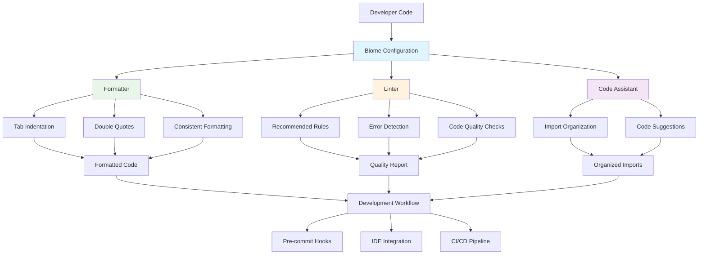
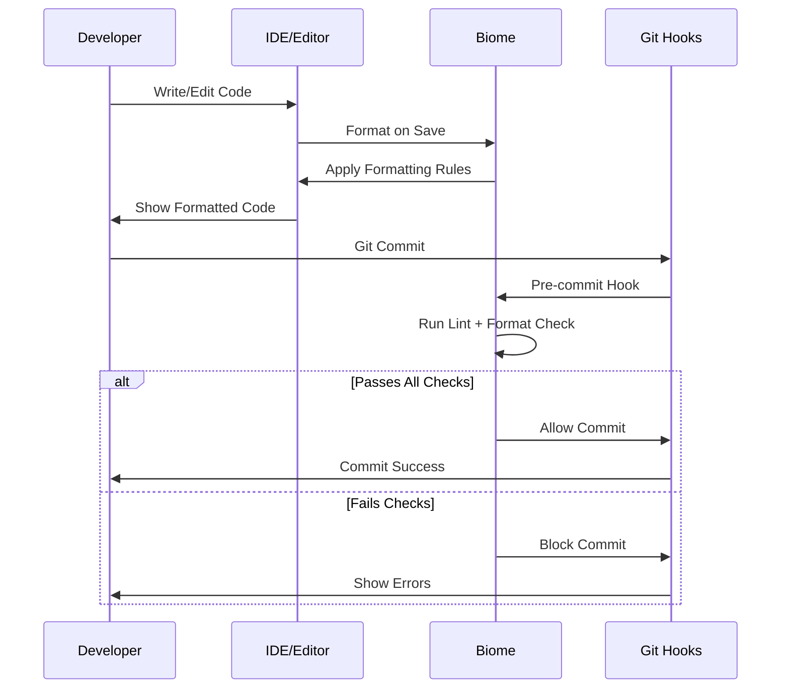

# Biome Configuration Documentation: `biome.json`

This document describes the configuration for Biome, a fast formatter and linter for web projects, as defined in `biome.json`.

## Overview

`biome.json` is the configuration file for Biome, which is used to enforce consistent code style and identify potential errors in the codebase. It combines the functionalities of a formatter, linter, and code assistant.

## Biome Integration Workflow

This diagram shows how Biome integrates with the OpenCut development workflow:



## Configuration Details

```json
{
	"$schema": "https://biomejs.dev/schemas/2.0.4/schema.json",
	"vcs": {
		"enabled": false,
		"clientKind": "git",
		"useIgnoreFile": false
	},
	"files": {
		"ignoreUnknown": false
	},
	"formatter": {
		"enabled": true,
		"indentStyle": "tab"
	},
	"linter": {
		"enabled": true,
		"rules": {
			"recommended": true
		}
	},
	"javascript": {
		"formatter": {
			"quoteStyle": "double"
		}
	},
	"assist": {
		"enabled": true,
		"actions": {
			"source": {
				"organizeImports": "on"
			}
		}
	}
}
```

### Sections Explained

*   `$schema`: Specifies the JSON schema for validation, ensuring the configuration file adheres to Biome's structure.

*   `vcs` (Version Control System):
    *   `enabled`: Set to `false`, indicating that Biome will not integrate directly with the VCS for operations like staging changes.
    *   `clientKind`: Specifies `git` as the VCS client, even though integration is disabled.
    *   `useIgnoreFile`: Set to `false`, meaning Biome will not automatically respect `.gitignore` files for ignoring files.

*   `files`:
    *   `ignoreUnknown`: Set to `false`, which means Biome will process all files, even those with unknown extensions.

*   `formatter`:
    *   `enabled`: Set to `true`, enabling code formatting.
    *   `indentStyle`: Configured to use `tab` for indentation, ensuring consistent tab-based indentation across the project.

*   `linter`:
    *   `enabled`: Set to `true`, enabling code linting.
    *   `rules.recommended`: Set to `true`, applying Biome's recommended set of linting rules to maintain code quality and catch common errors.

*   `javascript`:
    *   `formatter.quoteStyle`: Configured to use `double` quotes for strings in JavaScript/TypeScript files, enforcing a consistent quote style.

*   `assist`:
    *   `enabled`: Set to `true`, enabling code assistance features.
    *   `actions.source.organizeImports`: Set to `on`, which means Biome will automatically organize import statements in JavaScript/TypeScript files, improving readability and consistency.

## Development Commands

Common Biome commands used in the OpenCut development workflow:

```bash
# Format code with Biome
bun run lint

# Check formatting without making changes
biome format --check .

# Run linter on all files
biome lint .

# Fix linting issues automatically
biome lint --apply .

# Organize imports in files
biome check --apply .
```

## IDE Integration

Biome integrates with popular IDEs and editors:

- **VS Code**: Install the official Biome extension for real-time formatting and linting
- **WebStorm**: Built-in support for Biome configuration
- **Vim/Neovim**: Use language server protocol for Biome integration

## File Processing Flow



## Purpose

This `biome.json` configuration ensures that all JavaScript/TypeScript code in the OpenCut project adheres to a predefined set of formatting and linting rules, promoting code consistency, readability, and reducing the likelihood of bugs. It uses tabs for indentation, double quotes for strings, and automatically organizes imports.

## Recent Improvements (January 2025)

- **FIXED**: Build compilation errors and linting issues resolved through Biome configuration
- **IMPROVED**: Consistent code formatting across the entire codebase
- **ENHANCED**: Pre-commit hooks integration for automated quality checks