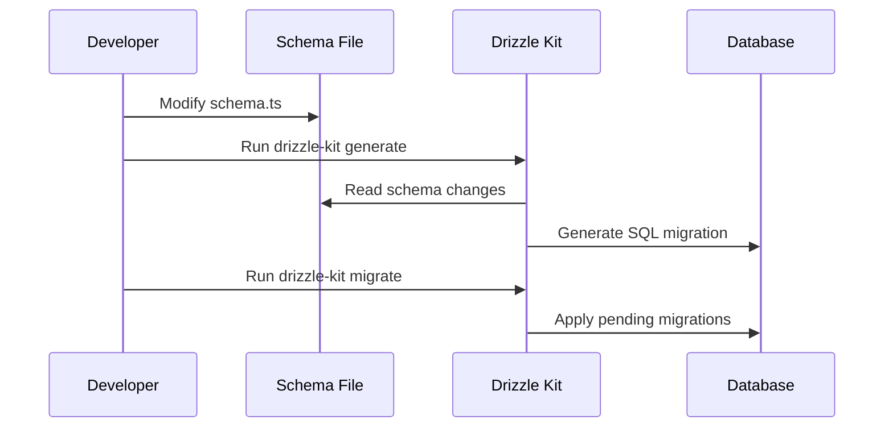
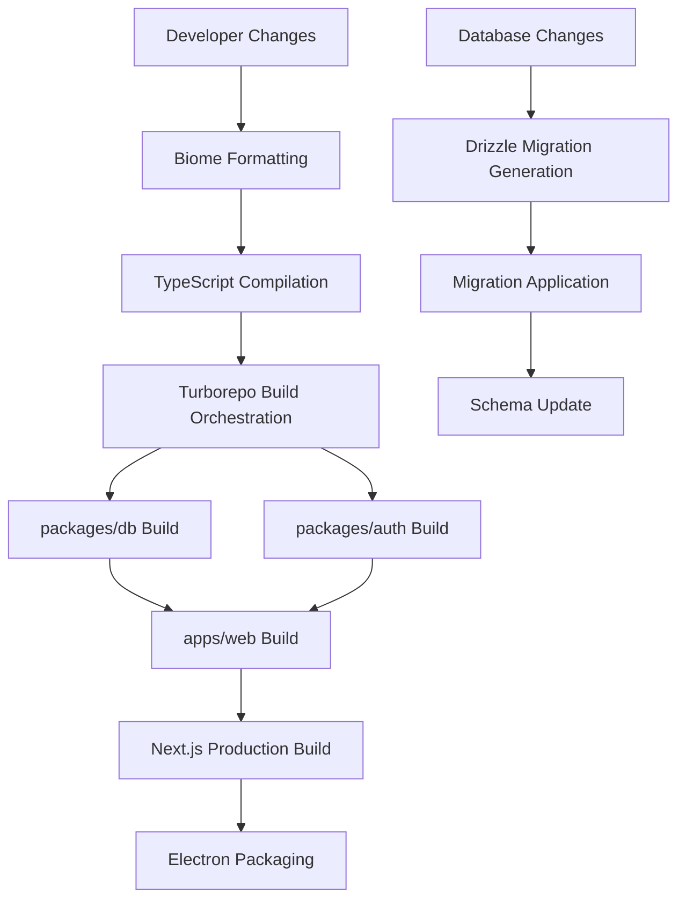

# OpenCut Development Documentation

This document covers the development tools and workflows used in the OpenCut project, including code formatting, database migrations, and build orchestration.

## Biome Configuration (`biome.json`)

Biome is used as the primary formatter and linter for the OpenCut codebase, providing fast and consistent code quality enforcement.

### Configuration Overview
- **Formatter**: Tab indentation, double quotes for JavaScript/TypeScript
- **Linter**: Recommended rules enabled for error detection and code quality
- **Assistant**: Automatic import organization and code suggestions

### Key Features
```json
{
  "formatter": {
    "enabled": true,
    "indentStyle": "tab"
  },
  "linter": {
    "enabled": true,
    "rules": { "recommended": true }
  },
  "javascript": {
    "formatter": { "quoteStyle": "double" }
  },
  "assist": {
    "enabled": true,
    "actions": { "source": { "organizeImports": "on" } }
  }
}
```

### Development Commands
```bash
# Format and lint code
bun run lint

# Check formatting without changes
biome format --check .

# Fix linting issues automatically
biome lint --apply .

# Organize imports and check code
biome check --apply .
```

### Integration Workflow
1. **IDE Integration**: Real-time formatting and linting in VS Code, WebStorm
2. **Pre-commit Hooks**: Automatic formatting and linting before commits
3. **CI/CD Pipeline**: Quality checks in continuous integration

## Database Migrations (`apps/web/migrations/`)

OpenCut uses Drizzle Kit for database schema management and migrations, ensuring consistent data structure across environments.

### Migration System
- **Sequential Migrations**: Numbered files (0000_, 0001_, etc.) applied in order
- **Schema-driven**: Generated from `packages/db/src/schema.ts` changes
- **Metadata Tracking**: Migration status and checksums stored in `meta/` directory

### Current Migrations
- `0000_hot_the_fallen.sql` - Initial database schema creation
- `0001_tricky_jackpot.sql` - Schema modifications and additions

### Migration Commands
```bash
# Generate new migration from schema changes
npx drizzle-kit generate

# Apply pending migrations to database
npx drizzle-kit migrate

# Check migration status
npx drizzle-kit up

# Database inspection tool
npx drizzle-kit studio
```

### Migration Workflow


### Best Practices
- Never edit applied migrations in production
- Test migrations on production data copies
- Create database backups before migrations
- Use sequential naming convention
- Plan rollback strategies for complex changes

## Turborepo Configuration (`turbo.json`)

Turborepo orchestrates the monorepo build system, optimizing task execution through caching and parallel processing.

### Monorepo Structure
- **apps/web** - Main Next.js web application
- **packages/db** - Database schema and utilities
- **packages/auth** - Authentication components

### Task Configuration
```json
{
  "tasks": {
    "build": {
      "dependsOn": ["^build"],
      "outputs": [".next/**", "!.next/cache/**"]
    },
    "check-types": {
      "dependsOn": ["^check-types"]
    },
    "dev": {
      "persistent": true,
      "cache": false
    }
  }
}
```

### Build Pipeline
1. **Dependency Resolution**: `^build` ensures dependencies build first
2. **Parallel Execution**: Independent packages build simultaneously  
3. **Intelligent Caching**: Only rebuilds changed components
4. **Output Management**: Caches `.next/` files, excludes cache directory

### Development Commands
```bash
# Build all packages in dependency order
bun run build

# Type check all packages
bun run check-types

# Start development servers
bun run dev

# Build specific package
turbo build --filter=@opencut/web

# Clear cache
turbo prune

# View dependency graph
turbo graph
```

### Performance Optimizations
- **Task Dependencies**: Proper build order with `^` syntax
- **Cache Efficiency**: Specific output patterns to avoid unnecessary caching
- **Persistent Tasks**: Development servers run continuously
- **Remote Caching**: Shared cache across team and CI/CD

## Integrated Development Workflow

### Build Architecture


### Quality Assurance Pipeline
1. **Code Formatting**: Biome enforces consistent style
2. **Type Checking**: Cross-package type safety validation
3. **Build Verification**: Ensure all packages compile successfully
4. **Database Integrity**: Migration validation and rollback planning

### Recent Improvements (January 2025)
- **Biome Integration**: Fixed build compilation errors and improved consistency
- **Migration System**: Enhanced schema evolution tracking
- **Build Optimization**: Improved cache efficiency and parallel execution
- **Development Experience**: Faster startup times and better error reporting

## Getting Started

### Prerequisites
- Node.js and Bun package manager
- PostgreSQL database for local development
- IDE with Biome extension (VS Code recommended)

### Setup Commands
```bash
# Install dependencies
bun install

# Setup database
npx drizzle-kit migrate

# Start development
bun run dev

# Build for production
bun run build
```

### Development Best Practices
- Use Biome formatting on save in your IDE
- Run type checks before committing
- Test database migrations locally before deployment
- Leverage Turborepo caching for faster builds
- Follow the established code style and import organization