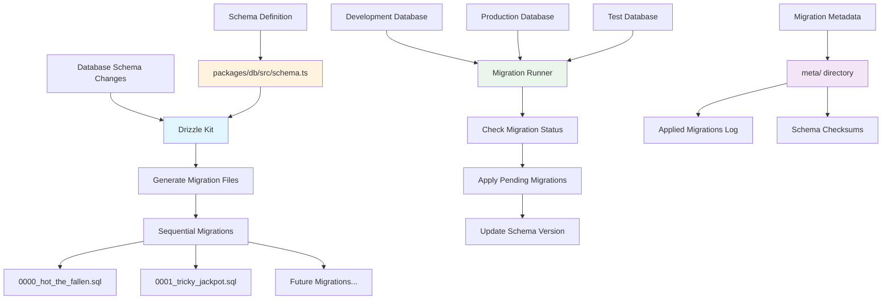
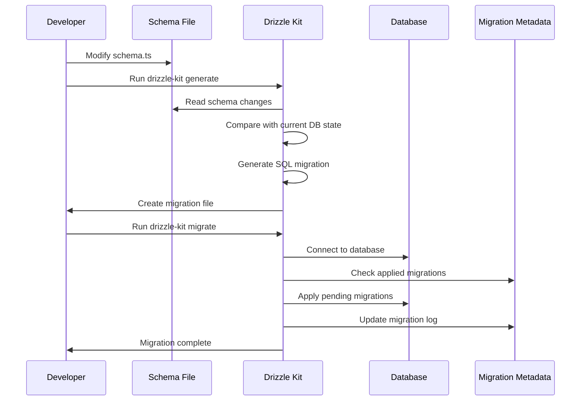
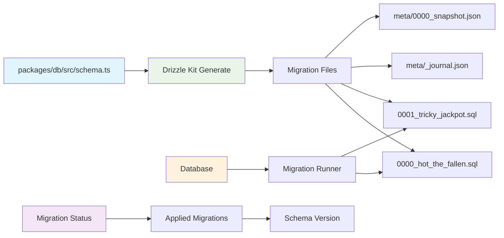
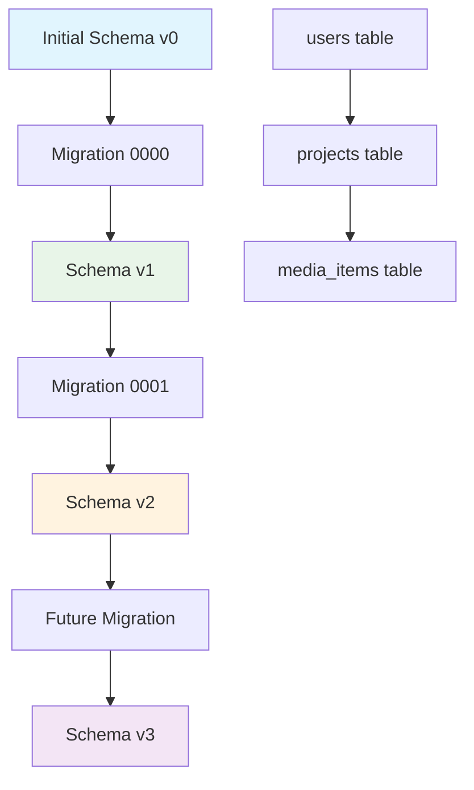

# Migrations Documentation: `apps/web/migrations/`

This document provides an overview of the database migration files located in the `apps/web/migrations/` directory. These files are used to manage changes to the application's database schema over time, ensuring data consistency and compatibility across different versions.

## Migration System Architecture

This diagram shows how database migrations are managed and applied in OpenCut:



## Migration Workflow



## Directories and Their Contents

### `meta/`

This directory typically contains metadata about the migrations, such as a record of applied migrations, checksums, or other internal information used by the migration tool (e.g., Drizzle Kit) to track the state of the database schema.

## Individual Files and Their Functionality

### `0000_hot_the_fallen.sql`

This SQL file represents the first database migration. It contains SQL statements to create the initial database schema, including tables, columns, constraints, and indexes, as defined at the very beginning of the project.

### `0001_tricky_jackpot.sql`

This SQL file represents a subsequent database migration. It contains SQL statements to modify the existing database schema, such as adding new tables, altering existing tables (e.g., adding columns, changing data types), or creating new indexes. The naming convention (e.g., `0001_`) indicates the order in which migrations should be applied.

## Migration Commands

Common Drizzle Kit commands for managing migrations:

```bash
# Generate a new migration based on schema changes
npx drizzle-kit generate

# Apply pending migrations to database
npx drizzle-kit migrate

# Check current migration status
npx drizzle-kit up

# Studio to inspect database (optional)
npx drizzle-kit studio
```

## File Relationships



## Best Practices

1. **Never edit applied migrations**: Once a migration has been applied to production, never modify it
2. **Test migrations**: Always test migrations on a copy of production data
3. **Backup before migrations**: Create database backups before applying migrations in production
4. **Sequential naming**: Use the generated sequential naming convention
5. **Rollback planning**: Consider rollback strategies for complex migrations

## Schema Evolution Example


