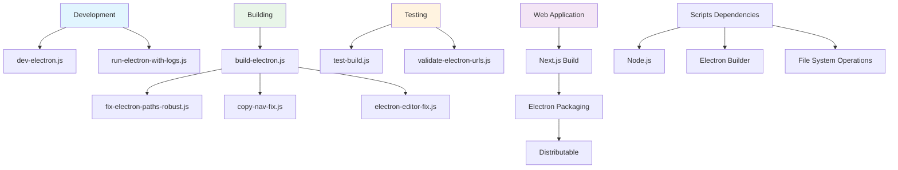
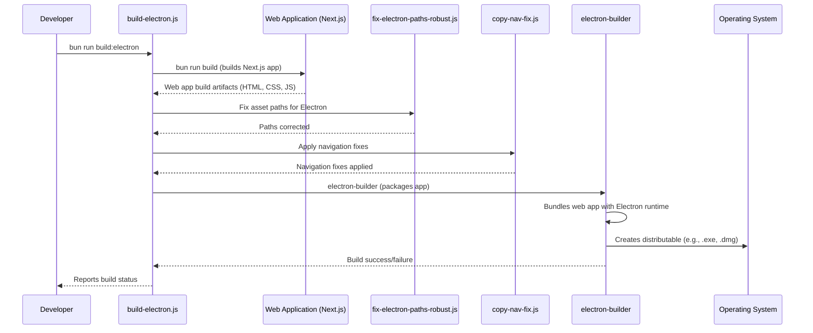
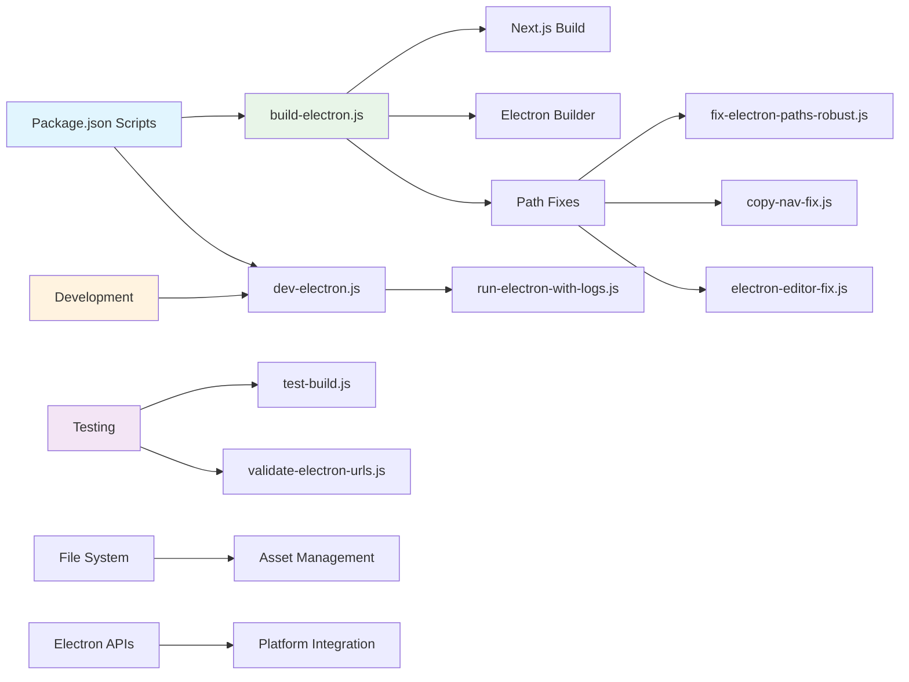
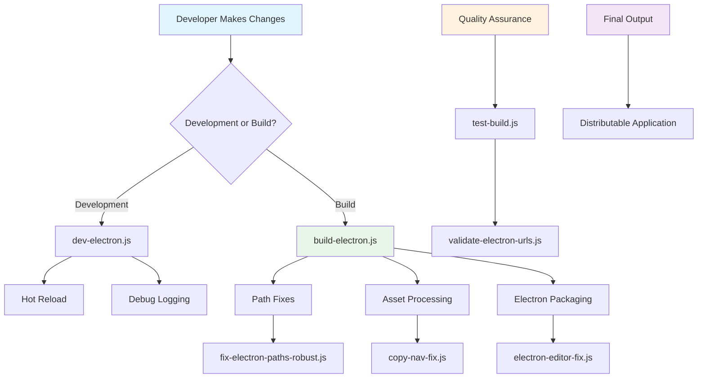

# Scripts Documentation: `apps/web/scripts/`

This document provides an overview of the utility scripts located in the `apps/web/scripts/` directory. These scripts automate various development, build, and maintenance tasks, especially those related to the Electron desktop application.

## Script Architecture Overview

This diagram shows how the different scripts interact with each other and the development workflow:



## High-Level Workflow: Electron Build Process

This diagram illustrates the typical steps and interactions involved in building the Electron desktop application, primarily orchestrated by `build-electron.js`.



## Individual Script Files and Their Functionality

### `build-electron.js`

This script is responsible for orchestrating the build process of the Electron desktop application. It handles:
- Compiling the web application
- Packaging it with Electron
- Generating distributable installers for different operating systems
- **Status**: ✅ Working for Windows builds (fixed January 2025)

### `dev-electron.js`

Development script that facilitates the Electron development workflow:
- Starts Electron app in development mode
- Enables hot-reloading
- Provides developer tools access
- Enhanced logging for debugging

### `run-electron-with-logs.js`

Enhanced version of the development script with comprehensive logging:
- Captures detailed output from main and renderer processes
- Useful for debugging complex issues
- Provides structured log output

### `fix-electron-paths-robust.js`

**Critical script** for resolving Electron-specific path issues:
- Fixes asset path resolution (images, fonts, CSS)
- Handles relative vs absolute path conflicts
- Ensures resources load correctly in Electron environment
- **Status**: ✅ Enhanced for Windows compatibility

### `copy-nav-fix.js`

Navigation fix deployment script:
- Copies navigation-related patches to correct locations
- Addresses known Electron navigation issues
- Part of the build process automation

### `electron-editor-fix.js`

Editor-specific patches for Electron environment:
- Resolves rendering issues in the video editor
- Performance optimizations for Electron
- Component compatibility fixes

### `test-build.js`

Build validation and testing script:
- Runs automated tests against packaged application
- Verifies feature functionality post-build
- Integration testing for Electron-specific features

### `validate-electron-urls.js`

URL validation and security script:
- Validates URL patterns for Electron app:// protocol
- Prevents navigation errors
- Security vulnerability prevention
- Path sanitization

## Script Dependencies and Relationships



## Usage Commands

Common commands for running these scripts:

```bash
# Development
bun run dev:electron          # Start Electron development
node scripts/run-electron-with-logs.js  # Development with logs

# Building
bun run build:electron        # Build Electron application
node scripts/build-electron.js  # Direct build script

# Testing
node scripts/test-build.js    # Test built application
node scripts/validate-electron-urls.js  # Validate URLs

# Maintenance
node scripts/fix-electron-paths-robust.js  # Fix path issues
node scripts/copy-nav-fix.js  # Apply navigation fixes
```

## Recent Improvements (January 2025)

### ✅ Windows Electron Build Success
- **FIXED**: All Windows Electron build issues resolved
- **IMPROVED**: Path resolution for Windows file systems
- **ENHANCED**: Build process reliability and error handling

### ✅ Script Enhancements
- **UPDATED**: Robust path fixing for cross-platform compatibility
- **IMPROVED**: Logging and debugging capabilities
- **FIXED**: Navigation issues in Electron environment

### Script Integration Flow



## Best Practices

1. **Always test scripts** on development builds before using in production
2. **Check logs** when builds fail - most issues are path-related
3. **Run validation** scripts after major changes
4. **Keep scripts updated** with Electron version changes
5. **Document custom fixes** for future maintenance