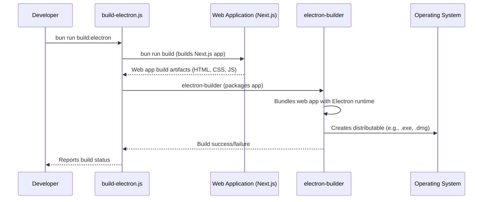

# Scripts Documentation: `apps/web/scripts/`

This document provides an overview of the utility scripts located in the `apps/web/scripts/` directory. These scripts automate various development, build, and maintenance tasks, especially those related to the Electron desktop application.

## Individual Script Files and Their Functionality

### High-Level Workflow: Electron Build Process

This diagram illustrates the typical steps and interactions involved in building the Electron desktop application, primarily orchestrated by `build-electron.js`.

### `build-electron.js`

This script is responsible for orchestrating the build process of the Electron desktop application. It typically handles tasks such as compiling the web application, packaging it with Electron, and generating distributable installers for different operating systems.

### `copy-nav-fix.js`

A script designed to copy a navigation-related fix file to a specific location. This is likely a workaround for a known navigation issue in the Electron build, ensuring the fix is applied during the build or deployment process.

### `dev-electron.js`

This script facilitates the development workflow for the Electron application. It typically starts the Electron app in development mode, enabling features like hot-reloading, developer tools, and logging for easier debugging.

### `electron-editor-fix.js`

A script that applies specific fixes or patches to the Electron build related to the editor component of the application. This might address rendering issues, performance problems, or compatibility quirks within the Electron environment.

### `fix-electron-paths-robust.js`

A robust script designed to fix file path issues that often arise when bundling web applications for Electron. It ensures that all asset paths (e.g., images, fonts, CSS) are correctly resolved within the Electron environment, preventing broken links or missing resources.

### `run-electron-with-logs.js`

This script is used to launch the Electron application with enhanced logging capabilities. It's particularly useful for debugging issues by capturing detailed output from both the main and renderer processes.

### `test-build.js`

A script for testing the integrity and functionality of the Electron build. It might run a series of automated tests against the packaged application to ensure that all features work as expected after the build process.

### `validate-electron-urls.js`

This script is used to validate URLs within the Electron application, ensuring they conform to expected patterns and prevent navigation errors or security vulnerabilities. It might check for correct protocol usage (e.g., `app://`) and handle relative paths.

### `build-electron.js`

This script is responsible for orchestrating the build process of the Electron desktop application. It typically handles tasks such as compiling the web application, packaging it with Electron, and generating distributable installers for different operating systems.

### `copy-nav-fix.js`

A script designed to copy a navigation-related fix file to a specific location. This is likely a workaround for a known navigation issue in the Electron build, ensuring the fix is applied during the build or deployment process.

### `dev-electron.js`

This script facilitates the development workflow for the Electron application. It typically starts the Electron app in development mode, enabling features like hot-reloading, developer tools, and logging for easier debugging.

### `electron-editor-fix.js`

A script that applies specific fixes or patches to the Electron build related to the editor component of the application. This might address rendering issues, performance problems, or compatibility quirks within the Electron environment.

### `fix-electron-paths-robust.js`

A robust script designed to fix file path issues that often arise when bundling web applications for Electron. It ensures that all asset paths (e.g., images, fonts, CSS) are correctly resolved within the Electron environment, preventing broken links or missing resources.

### `run-electron-with-logs.js`

This script is used to launch the Electron application with enhanced logging capabilities. It's particularly useful for debugging issues by capturing detailed output from both the main and renderer processes.

### `test-build.js`

A script for testing the integrity and functionality of the Electron build. It might run a series of automated tests against the packaged application to ensure that all features work as expected after the build process.

### `validate-electron-urls.js`

This script is used to validate URLs within the Electron application, ensuring they conform to expected patterns and prevent navigation errors or security vulnerabilities. It might check for correct protocol usage (e.g., `app://`) and handle relative paths.
