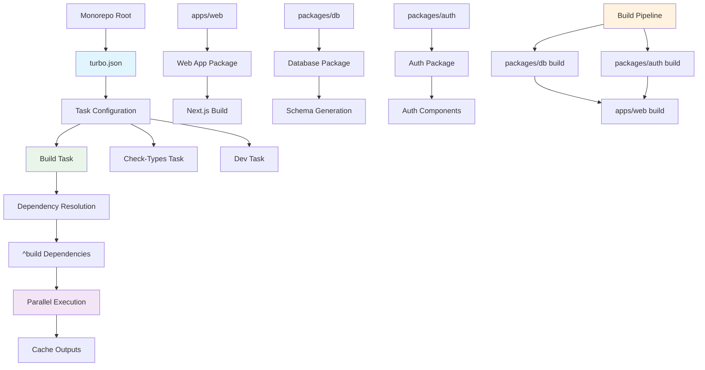
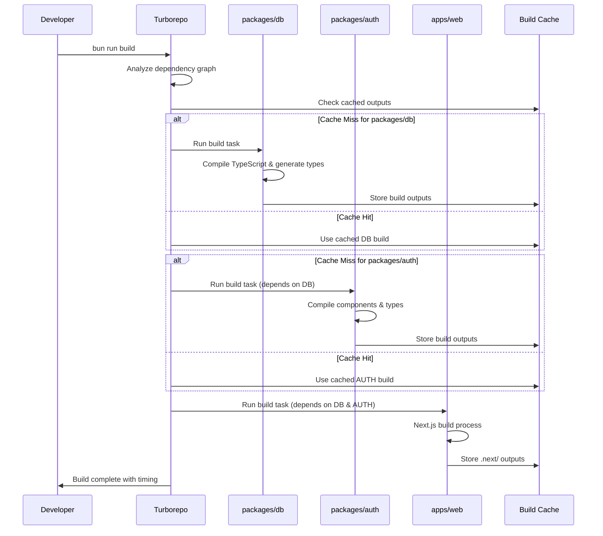
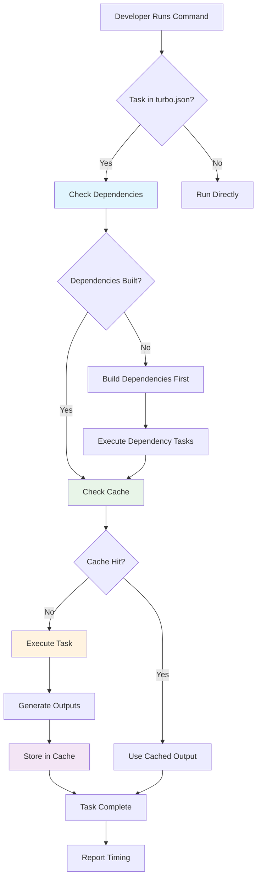
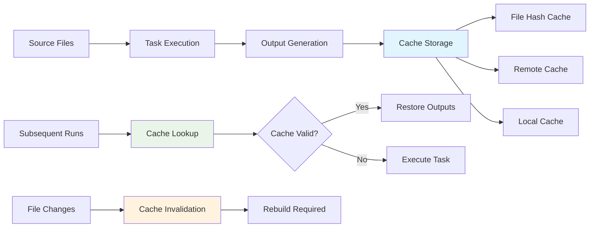

# Turborepo Configuration Documentation: `turbo.json`

This document describes the `turbo.json` file, which configures Turborepo for the OpenCut monorepo. Turborepo is a high-performance build system for JavaScript and TypeScript codebases.

## Overview

`turbo.json` defines how Turborepo should execute tasks (scripts) across the monorepo's workspaces. It optimizes build times by caching previous build outputs, running tasks in parallel, and understanding dependencies between packages.

## Turborepo Architecture in OpenCut

This diagram shows how Turborepo orchestrates the build pipeline across the OpenCut monorepo:



## Workspace Dependencies Flow

This diagram illustrates how package dependencies flow through the Turborepo build system:



## Configuration Details

```json
{
    "$schema": "https://turborepo.com/schema.json",
    "tasks": {
      "build": {
        "dependsOn": ["^build"],
        "outputs": [".next/**", "!.next/cache/**"]
      },
      "check-types": {
        "dependsOn": ["^check-types"]
      },
      "dev": {
        "persistent": true,
        "cache": false
      }
    }
  }
```

## Sections Explained

*   `$schema`: Specifies the JSON schema for validation, ensuring the configuration file adheres to Turborepo's structure.

*   `tasks`: This object defines how specific npm scripts (tasks) should be handled by Turborepo.

    ### `build` task
    *   `dependsOn`: `["^build"]`
        *   This tells Turborepo that before building a package, it should first build all of its dependencies. The `^` symbol indicates that it should look for the `build` script in the dependencies' `package.json` files.
    *   `outputs`: `[".next/**", "!.next/cache/**"]`
        *   This specifies which files and directories generated by the `build` task should be cached. `.next/**` includes all files within the `.next` directory (common for Next.js builds). `!.next/cache/**` explicitly excludes the cache directory itself from being cached, as it contains temporary files that don't need to be persisted.

    ### `check-types` task
    *   `dependsOn`: `["^check-types"]`
        *   Similar to `build`, this ensures that type checking is performed on dependencies before the current package, maintaining type safety across the monorepo.

    ### `dev` task
    *   `persistent`: `true`
        *   This indicates that the `dev` task should run continuously (e.g., a development server) and not terminate after completion. Turborepo will keep these processes running in the background.
    *   `cache`: `false`
        *   This tells Turborepo *not* to cache the output of the `dev` task. Development servers typically produce logs and temporary files that are not meant for caching and would only slow down the development process if cached.

## Task Execution Flow

This diagram shows how individual tasks are executed and cached:



## Cache Management System



## Development Commands

Common Turborepo commands used in OpenCut development:

```bash
# Build all packages in dependency order
bun run build

# Run type checking across all packages
bun run check-types

# Start development servers
bun run dev

# Build specific package
turbo build --filter=@opencut/web

# Clear Turborepo cache
turbo prune

# View build dependency graph
turbo graph
```

## Performance Optimizations

### Task Configuration Best Practices

```json
{
  "build": {
    "dependsOn": ["^build"],
    "outputs": [".next/**", "!.next/cache/**"],
    "inputs": ["src/**", "public/**", "package.json", "tsconfig.json"]
  },
  "check-types": {
    "dependsOn": ["^build"],
    "outputs": []
  }
}
```

### Cache Efficiency Tips

1. **Specific Output Patterns**: Define precise output directories to avoid caching unnecessary files
2. **Input Specifications**: Use `inputs` to control when tasks should be re-run
3. **Dependency Management**: Use `^` syntax for cross-package dependencies
4. **Persistent Tasks**: Mark development servers as `persistent: true`

## Purpose

This `turbo.json` file is crucial for optimizing the development and build workflows in the OpenCut monorepo. It enables:

*   **Faster Builds:** By caching build outputs and only rebuilding what's changed.
*   **Correct Order of Operations:** Ensuring that dependent packages are built or type-checked before their consumers.
*   **Efficient Development:** By allowing development servers to run persistently without unnecessary caching.
*   **Parallel Execution:** Running independent tasks simultaneously for better performance.
*   **Remote Caching:** Sharing build cache across team members and CI/CD pipelines.

It centralizes the configuration for how tasks are executed across the multiple `apps` and `packages` within the OpenCut project.

## Integration with OpenCut Development Workflow

### Build Pipeline Integration

The Turborepo configuration integrates seamlessly with OpenCut's development tools:

- **Next.js**: Optimized for Next.js build outputs with proper cache exclusions
- **TypeScript**: Dependency-aware type checking across packages
- **Electron**: Build process coordination for desktop app packaging
- **Testing**: Parallel test execution across workspaces

### Recent Improvements (January 2025)

- **ENHANCED**: Cache efficiency with specific output patterns
- **IMPROVED**: Build dependency resolution for complex monorepo structure
- **OPTIMIZED**: Development server startup time with persistent task configuration