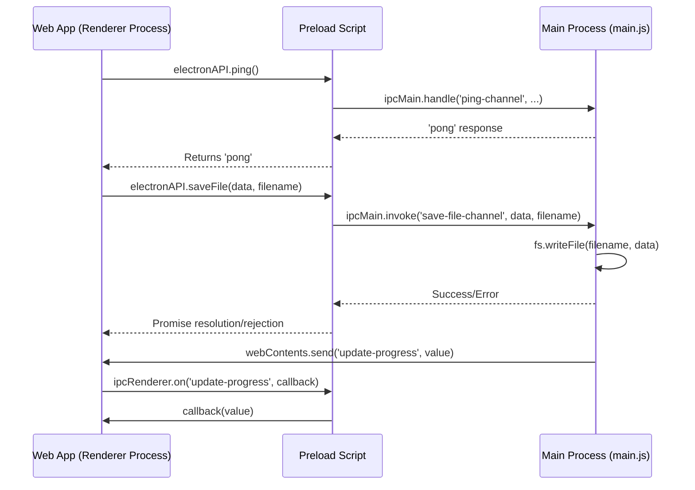

# Electron Documentation: `apps/web/electron/`

This document provides an overview of the Electron-specific files and their functionalities within the `apps/web/electron/` directory. These files are crucial for building and running the OpenCut desktop application.

## Directories and Their Contents

### `assets/`

This directory typically contains static assets specific to the Electron application, such as icons, images, or other resources that are bundled with the desktop application.

## Individual Files and Their Functionality

### High-Level Workflow: Electron IPC Communication

This diagram illustrates a common pattern of Inter-Process Communication (IPC) in Electron, where the renderer process (your web app) requests a service from the main process (Node.js backend).

### `main.js`

This is the main process file for the Electron application. It is responsible for: 
*   Creating and managing browser windows.
*   Handling system events (e.g., app ready, window close).
*   Setting up the main application menu.
*   Managing inter-process communication (IPC) between the main process and renderer processes.
*   Potentially handling native desktop features like file system access, notifications, or global shortcuts.

### `main-simple_archive.js`

An archived or simplified version of the `main.js` file. This might be an older version, a stripped-down version for specific build configurations, or a backup.

### `navigation-fix_archive.js`

An archived file likely containing a previous implementation or a specific fix related to navigation issues within the Electron application. This could be a reference for past solutions or a temporary workaround that was later replaced.

### `preload-simplified_archive.js`

An archived or simplified version of a preload script. Preload scripts run before the renderer process's web content loads and are used to expose Node.js APIs to the renderer, or to perform other setup tasks in a sandboxed environment.

### `main.js`

This is the main process file for the Electron application. It is responsible for: 
*   Creating and managing browser windows.
*   Handling system events (e.g., app ready, window close).
*   Setting up the main application menu.
*   Managing inter-process communication (IPC) between the main process and renderer processes.
*   Potentially handling native desktop features like file system access, notifications, or global shortcuts.

### `main-simple_archive.js`

An archived or simplified version of the `main.js` file. This might be an older version, a stripped-down version for specific build configurations, or a backup.

### `navigation-fix_archive.js`

An archived file likely containing a previous implementation or a specific fix related to navigation issues within the Electron application. This could be a reference for past solutions or a temporary workaround that was later replaced.

### `preload-simplified_archive.js`

An archived or simplified version of a preload script. Preload scripts run before the renderer process's web content loads and are used to expose Node.js APIs to the renderer, or to perform other setup tasks in a sandboxed environment.
