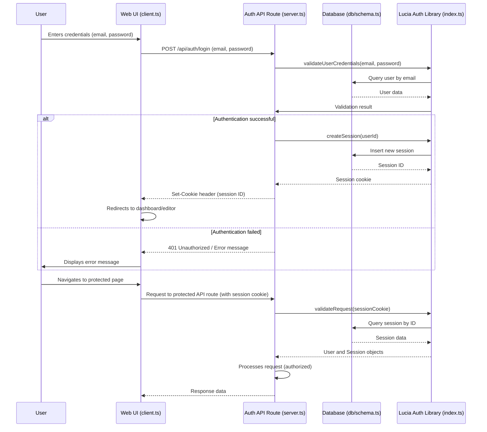
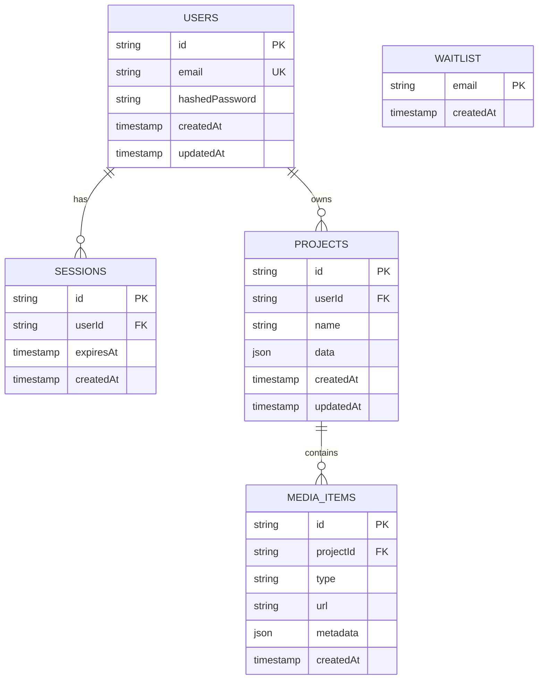

# OpenCut Packages Documentation

This document provides an overview of the core packages used in the OpenCut application, focusing on the authentication and database packages that provide essential infrastructure services.

## Authentication Package: `packages/auth/src/`

The authentication package encapsulates all authentication logic for OpenCut, designed to be reusable across different parts of the system. It uses Lucia Auth as the core authentication library.

### Package Structure

#### `client.ts`
Contains client-side authentication logic including:
- `useSession`: React hook to manage and provide current user session state
- `signIn`: Function to handle user login requests
- `signUp`: Function to handle new user registration
- `signOut`: Function to handle user logout

#### `index.ts`
Main entry point for the authentication package that exports:
- Core authentication setup
- Shared utilities between client and server
- Lucia authentication instance

#### `server.ts`
Server-side authentication logic responsible for:
- Validating user credentials
- Creating and managing user sessions
- Handling authentication API routes (`/api/auth/login`, `/api/auth/signup`)
- Interacting with the database for user and session data

### User Authentication Flow

## Database Package: `packages/db/src/`

The database package encapsulates the database schema and interaction logic for OpenCut, using Drizzle ORM as the primary database toolkit.

### Package Structure

#### `index.ts`
Main entry point for the database package responsible for:
- Configuring and exporting Drizzle ORM instances
- Establishing database connections (using `postgres.js`)
- Loading the database schema for use in queries and migrations

#### `schema.ts`
Defines the entire database schema using Drizzle ORM's declarative API:
- Table definitions: `users`, `sessions`, `projects`, `mediaItems`, `waitlist`
- Column definitions with data types and constraints
- Relationships between tables (foreign keys)

### Database Schema Overview

## Package Integration

Both packages work together to provide a complete authentication and data persistence solution:

1. **Authentication Flow**: The auth package uses the db package to store and retrieve user credentials and session data
2. **Protected Resources**: API routes use the auth package to validate sessions before allowing access to database operations
3. **Type Safety**: Both packages share TypeScript types to ensure type safety across the application

## Best Practices

- Always use the exported functions from `packages/auth/client.ts` for client-side authentication
- Server-side routes should validate sessions using `packages/auth/server.ts` utilities
- Database migrations should be managed through Drizzle's migration system
- Keep sensitive configuration in environment variables, never in code