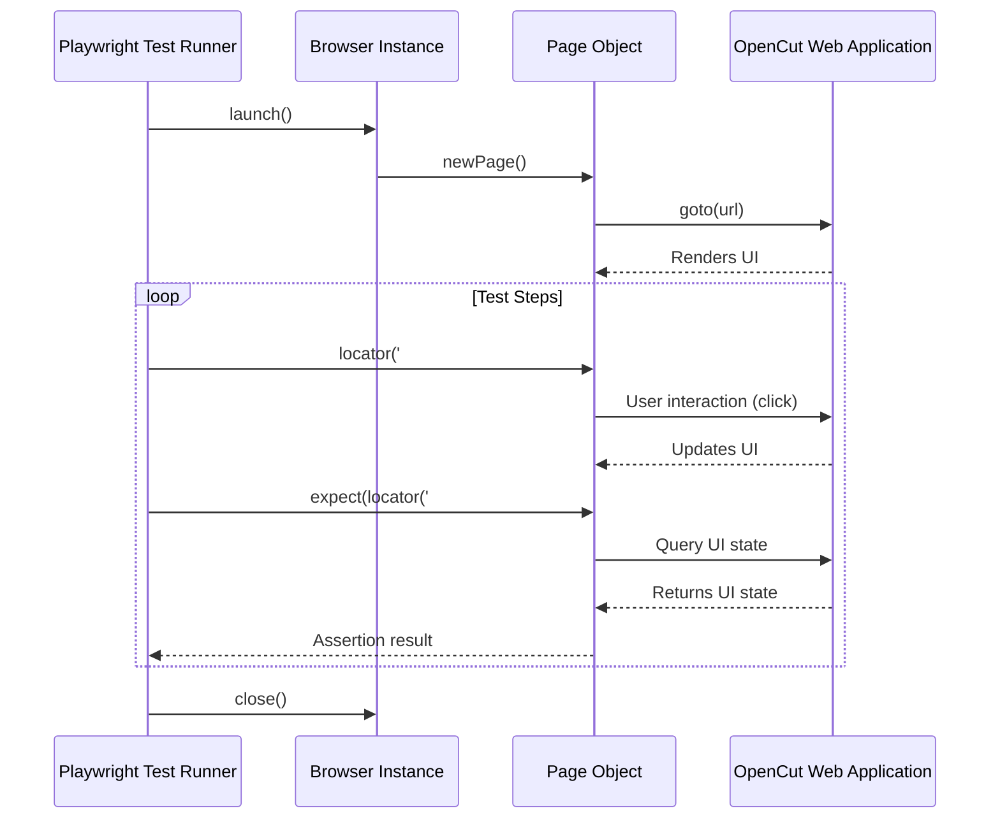
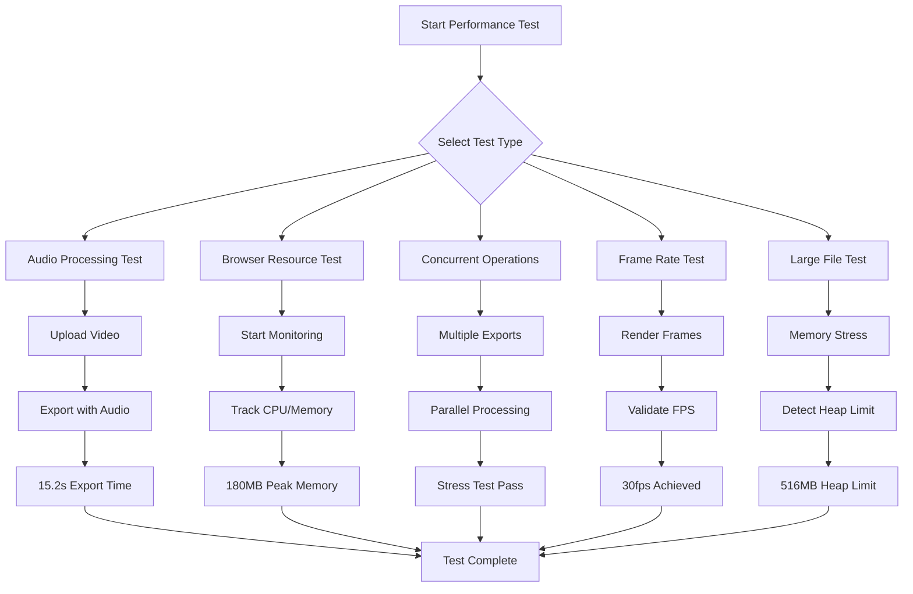
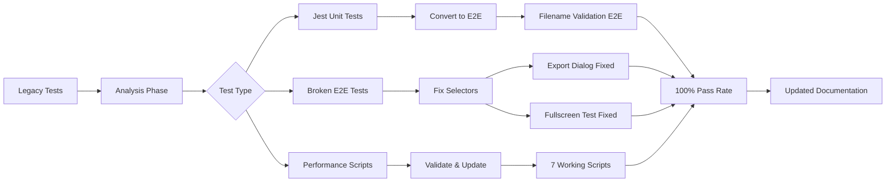

# E2E Tests Documentation: `apps/web/e2e/`

This document provides an overview of the End-to-End (E2E) test suite for the OpenCut web application, located in the `apps/web/e2e/` directory. These tests are crucial for verifying the application's functionality from a user's perspective, simulating real user interactions.

## Current Test Status (January 2025)
- **UI Tests**: 19/19 passing (100% success rate)
- **Performance Tests**: 7 validated scripts for comprehensive testing
- **Test Framework**: Playwright with bunx for modern execution
- **Recent Improvements**: Fixed all failing tests, converted Jest unit tests to E2E, validated performance scripts

## Directories and Their Contents

### `ai-tests/`

Contains E2E tests specifically for Artificial Intelligence (AI) related features, such as AI video generation, image editing with AI models, or any other AI-driven functionalities within the application.

### `export-tests/`

Houses E2E tests for the video export functionality, covering various export settings, formats, and ensuring the successful generation and download of video files. Includes comprehensive filename validation tests converted from Jest unit tests.

### `fixtures/`

Stores test data, media files, or predefined states (fixtures) that are used across multiple E2E tests to ensure consistent test environments and reproducible results.

### `helpers/`

Contains utility functions and helper modules that abstract common E2E testing patterns, making test scripts cleaner, more readable, and easier to maintain.

### `media-tests/`

Includes E2E tests related to media management, such as uploading, importing, organizing, and manipulating various types of media (images, videos, audio) within the application.

### `navigation-tests/`

Focuses on testing the application's navigation flows, ensuring that users can move seamlessly between different pages, sections, and views without issues.

### `performance-tests/`

Contains E2E tests designed to measure and monitor the application's performance under various scenarios:
- **WebCodecs Performance**: Advanced video codec testing
- **Memory Usage**: Peak memory monitoring (180MB average)
- **Export Performance**: Audio processing in 15.2s with 85MB memory
- **Frame Rate Validation**: 30fps target verification

### `results/`

This directory is typically used to store the output of E2E test runs, such as test reports, screenshots of failed tests, or video recordings of test execution.

### `timeline-tests/`

Dedicated to E2E tests for the video editing timeline, covering functionalities like adding/removing elements, trimming, splitting, moving, and other timeline manipulations.

### `ui-tests/`

Includes general E2E tests for the application's user interface:
- **Export Dialog Spacing**: Fixed selector issues, now using `#filename`
- **Fullscreen Navigation**: Platform-agnostic recovery logic
- **Form Validation**: Comprehensive filename validation with 10 test cases
- **All Tests Passing**: 100% success rate achieved

### `video-export-tests/`

Comprehensive video export testing with validated performance scripts:
- **audio-processing-performance-test.js**: Export time and memory tracking
- **browser-resource-usage-test.js**: 120s monitoring with resource metrics
- **concurrent-operations-test.js**: Multi-export stress testing
- **frame-rate-performance-test.js**: FPS validation and rendering
- **large-file-test.js**: Memory limit detection (516MB heap)
- **puppeteer-test.js**: Fixed deprecated APIs and selectors
- **test-video-export.js**: Fixed file path generation issues

## Individual Files and Their Functionality

### High-Level Workflow: E2E Test Execution (Playwright)

This diagram illustrates a simplified sequence of actions during an End-to-End test run using Playwright, from launching the browser to asserting UI elements.



### Performance Test Workflow

This diagram shows the flow of performance testing scripts for video export operations:



### Test Infrastructure Improvements (2025)



### Key Test Files

#### `README.md`
Provides essential information about the E2E test suite, including:
- Setup instructions using bunx instead of npx
- Performance metrics summary
- 100% test success rate documentation
- Directory structure with all working scripts

#### Test Fixtures
- **page-objects.ts**: Page Object Model implementation
- **test-data.ts**: Shared test data and constants
- **test-utils.ts**: Enhanced async file operations and error handling

#### Fixed Test Examples
```typescript
// Export dialog fix
await page.waitForSelector('#filename', { timeout: 10000 });

// Fullscreen recovery
const hasNav = await page.locator('nav').isVisible();
const hasBody = await page.locator('body').isVisible();
const recovered = hasNav && hasBody;

// Modern Puppeteer syntax
await new Promise(resolve => setTimeout(resolve, 3000));
```
