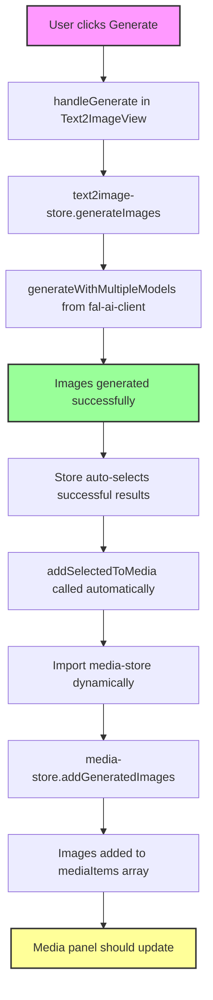

# Text2Image Media Panel Issue

## Problem Description
After generating images using the Text2Image feature, the generated images do not automatically appear in the media panel.

## Console Logs
```
Text2ImageView store state: {prompt: '', selectedModels: Array(3), generationMode: 'multi', isGenerating: false, hasResults: false}
C:\Users\zdhpe\Desktop\New folder\OpenCut\apps\web\src\components\editor\media-panel\views\text2image.tsx:51 Available models:
```

## Issue Details
- Location: `apps\web\src\components\editor\media-panel\views\text2image.tsx`
- The Text2Image view successfully generates images
- However, generated images are not automatically added to the media panel
- Users need to manually refresh or re-add the images

## Expected Behavior
Generated images should automatically appear in the media panel after generation is complete.

## Possible Causes
1. Missing integration between Text2Image component and media store
2. Generated images not being properly added to the media store after creation
3. Media panel not refreshing/re-rendering after new images are added
4. File path or reference issues preventing auto-import

## Investigation Needed
- Check if Text2Image component properly calls media store's add function after generation
- Verify media panel subscribes to media store updates
- Ensure generated image files are properly saved and accessible
- Check for any error handling that might be silently failing

## Source Code Analysis

### Function Call Flow Diagram



### Key Functions and Flow

#### 1. **Text2ImageView Component** (`text2image.tsx`)
- **handleGenerate()** (line 60-84): Initiates image generation
- **handleAddToMedia()** (line 86-89): Manual add to media (for button clicks)
- Single mode has "Add to Media Panel" button (line 296-308)
- Multi mode has checkbox selection and bulk add button (line 377-386)

#### 2. **Text2Image Store** (`text2image-store.ts`)
- **generateImages()** (line 119-212): Main generation function
  - Sets isGenerating = true
  - Calls generateWithMultipleModels()
  - On success: Auto-selects all successful results (line 171-184)
  - **IMPORTANT**: Automatically calls addSelectedToMedia() (line 186-190)
  
- **addSelectedToMedia()** (line 214-258): Adds images to media store
  - Dynamically imports media-store to avoid circular deps (line 232)
  - Maps results to MediaItem format (line 235-248)
  - Calls media-store.addGeneratedImages() (line 251)
  - Clears selections after adding (line 257)

#### 3. **Media Store** (`media-store.ts`)
- **addGeneratedImages()** (line 358-375): Receives generated images
  - Creates MediaItem objects with unique IDs
  - Adds to mediaItems array in store
  - Sets metadata.source = "text2image"
  - Logs success message

### What's Actually Happening

Based on the code analysis, the flow is actually correct and images SHOULD be automatically added:

1. When images are generated successfully, the text2image-store automatically calls `addSelectedToMedia()` (line 189 in text2image-store.ts)
2. This function properly imports the media store and calls `addGeneratedImages()`
3. The media store receives the images and adds them to the `mediaItems` array

### Why Images Might Not Appear

The code is working correctly, but there are several potential issues:

1. **Dynamic Import Timing**: The media store is imported dynamically (line 232). There might be a race condition or import failure.

2. **Store State Not Updating UI**: The media panel component might not be re-rendering when mediaItems changes.

3. **Project ID Missing**: The regular `addMediaItem` requires a projectId, but `addGeneratedImages` doesn't use projectId or persistent storage - it only updates local state.

4. **Console Logs Show Success**: Line 374 logs "Added X generated images to media panel", so check if this message appears.

5. **Possible Fix Needed**: The generated images are added to local state only, not persisted. They might disappear on refresh or project switch.

### Recommended Debug Steps

1. Check browser console for:
   - "Adding X generated images to media panel" message
   - "Added X generated images to media panel" message
   - Any import errors for media-store

2. Verify the media panel component subscribes to mediaItems changes

3. Check if switching tabs/panels and back shows the images

4. The issue might be that generated images aren't persisted to storage, only kept in memory