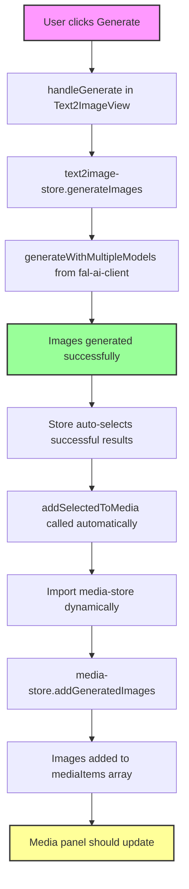

# Text2Image Media Panel Issue

## Problem Description
Generated Text2Image images appear in the media panel but cannot be dragged to the timeline due to missing File object.

## Root Cause
Generated images only have a URL (from fal.media) but no File object, causing timeline validation to fail:

```
❌ Invalid file reference: {
  id: '41957e94-036b-4265-b6ce-714d2c5f4ce0', 
  hasFile: false, 
  isFileInstance: false, 
  fileType: 'undefined'
}
```

## Issue Details
- Generated images ARE successfully added to media panel ✓
- They display correctly in the media panel ✓  
- They CANNOT be dragged to timeline ✗
- Timeline requires a File object but generated images only have URLs

## Solution Needed
Generated images need to be converted from URLs to File objects before being added to the timeline. Options:
1. Download the image URL and create a File/Blob object
2. Modify timeline to accept URL-based media items
3. Add a conversion step when dragging generated images

## Source Code Analysis

### Function Call Flow Diagram



### Key Functions and Flow

#### 1. **Text2ImageView Component** (`text2image.tsx`)
- **handleGenerate()** (line 60-84): Initiates image generation
- **handleAddToMedia()** (line 86-89): Manual add to media (for button clicks)
- Single mode has "Add to Media Panel" button (line 296-308)
- Multi mode has checkbox selection and bulk add button (line 377-386)

#### 2. **Text2Image Store** (`text2image-store.ts`)
- **generateImages()** (line 119-212): Main generation function
  - Sets isGenerating = true
  - Calls generateWithMultipleModels()
  - On success: Auto-selects all successful results (line 171-184)
  - **IMPORTANT**: Automatically calls addSelectedToMedia() (line 186-190)
  
- **addSelectedToMedia()** (line 214-258): Adds images to media store
  - Dynamically imports media-store to avoid circular deps (line 232)
  - Maps results to MediaItem format (line 235-248)
  - Calls media-store.addGeneratedImages() (line 251)
  - Clears selections after adding (line 257)

#### 3. **Media Store** (`media-store.ts`)
- **addGeneratedImages()** (line 358-375): Receives generated images
  - Creates MediaItem objects with unique IDs
  - Adds to mediaItems array in store
  - Sets metadata.source = "text2image"
  - Logs success message

### What's Actually Happening

Based on console logs, the issue is NOT that images don't appear in media panel - they do!

The real issue is that generated images cannot be dragged to the timeline because:
- Generated images have `url` but no `file` property
- Timeline's `handleDrop` function checks `if (!mediaItem.file)` and rejects the drop
- The validation fails with "Invalid file reference"

### Timeline Drop Validation (timeline.tsx:532)
```javascript
if (!mediaItem.file) {
  console.error('❌ Invalid file reference:', {
    id: draggedItem.id,
    hasFile: !!mediaItem.file,
    isFileInstance: mediaItem.file instanceof File,
    fileType: typeof mediaItem.file
  });
  return;
}
```

### Recommended Solution: Convert URL to File when adding to media store

**Files to modify:**
- `apps/web/src/stores/media-store.ts` - Update `addGeneratedImages()` function (line 358)

**Implementation approach:**
1. Before creating MediaItem objects, fetch each image URL
2. Convert the fetched data to a Blob
3. Create a File object from the Blob with appropriate name and type
4. Add the File object to the MediaItem along with the URL

**Current code structure (line 358-389):**
```javascript
addGeneratedImages: (items) => {
  // Convert items to full MediaItem objects with IDs
  const newItems: MediaItem[] = items.map((item) => ({
    ...item,
    id: generateUUID(),
    metadata: {
      ...item.metadata,
      source: "text2image",
    },
  }));
  
  // Add to local state
  set((state) => ({
    mediaItems: [...state.mediaItems, ...newItems],
  }));
}
```

**Required changes:**
- Add async URL fetching before the `items.map()` 
- Create File objects from the fetched image data
- Include both `file` and `url` properties in the MediaItem