# Image Adjustment Models Implementation Plan

## Overview
Implementation of image-to-image editing models in the Adjustment panel, providing users with AI-powered image editing capabilities using FAL.ai models.

## Models to Implement

### 1. SeedEdit v3 (ByteDance)
- **Endpoint**: `fal-ai/bytedance/seededit/v3/edit-image`
- **Capabilities**: Precise image editing with content preservation
- **Strengths**: Real image editing, accurate instruction following
- **Input**: Image + Text prompt (max 700 chars)
- **Parameters**: Guidance scale (0-1, default 0.5), Seed
- **Best for**: Photo retouching, object modification, realistic edits

### 2. FLUX Pro Kontext
- **Endpoint**: `fal-ai/flux-pro/kontext`
- **Capabilities**: Context-aware image editing with text and reference
- **Strengths**: Local edits, scene transformations
- **Input**: Image + Text prompt + Reference (optional)
- **Parameters**: Guidance scale (default 3.5), Steps (28), Safety (2)
- **Best for**: Style changes, object replacement, scene modification

### 3. FLUX Pro Kontext Max
- **Endpoint**: `fal-ai/flux-pro/kontext/max`
- **Capabilities**: Advanced version with complex task handling
- **Strengths**: Typography, complex transformations, premium consistency
- **Input**: Same as Kontext with enhanced processing
- **Parameters**: Same as Kontext with improved performance
- **Best for**: Complex edits, typography, professional-grade adjustments

## Architecture Plan

```mermaid
graph TB
    A[Adjustment Panel] --> B[Image Upload Area]
    A --> C[Model Selection]
    A --> D[Edit Parameters]
    A --> E[Preview & History]
    
    B --> B1[Drag & Drop Zone]
    B --> B2[File Browser]
    B --> B3[From Media Panel]
    
    C --> C1[SeedEdit v3<br/>Basic Edits]
    C --> C2[FLUX Pro Kontext<br/>Context-Aware]
    C --> C3[FLUX Pro Kontext Max<br/>Advanced]
    
    D --> D1[Text Prompt Input]
    D --> D2[Guidance Scale Slider]
    D --> D3[Steps/Iterations]
    D --> D4[Safety Settings]
    D --> D5[Seed Control]
    
    E --> E1[Before/After Preview]
    E --> E2[Edit History Stack]
    E --> E3[Download Options]
    E --> E4[Add to Timeline]
    
    F[API Integration] --> F1[Image Upload to FAL]
    F --> F2[Progress Tracking]
    F --> F3[Result Processing]
    F --> F4[Error Handling]
    
    G[State Management] --> G1[Adjustment Store]
    G --> G2[Image Cache]
    G --> G3[Edit History]
    G --> G4[Settings Persistence]
```

## Files to Create/Modify

### New Files to Create

#### 1. Adjustment Panel Components
- `apps/web/src/components/editor/media-panel/views/adjustment.tsx`
  - Main adjustment panel interface
  - Image upload area with drag & drop
  - Model selection cards
  - Parameter controls
  - Preview components

#### 2. Image Editing API Client
- `apps/web/src/lib/image-edit-client.ts`
  - API functions for all three models
  - Image upload handling
  - Progress tracking integration
  - Error handling and validation

#### 3. Adjustment Store
- `apps/web/src/stores/adjustment-store.ts`
  - State management for image editing
  - Edit history management
  - Settings persistence
  - Cache management

#### 4. UI Components
- `apps/web/src/components/editor/adjustment/model-selector.tsx`
  - Model selection cards with descriptions
- `apps/web/src/components/editor/adjustment/image-uploader.tsx`
  - Drag & drop image upload component
- `apps/web/src/components/editor/adjustment/parameter-controls.tsx`
  - Sliders and inputs for model parameters
- `apps/web/src/components/editor/adjustment/preview-panel.tsx`
  - Before/after comparison view
- `apps/web/src/components/editor/adjustment/edit-history.tsx`
  - Stack of previous edits with undo/redo

#### 5. Utility Functions
- `apps/web/src/lib/image-utils.ts`
  - Image processing utilities
  - Format conversion
  - Validation functions

### Files to Modify

#### 1. Media Panel Index
- `apps/web/src/components/editor/media-panel/index.tsx`
  - Replace adjustment placeholder with `<AdjustmentView />`
  - Import the new component

#### 2. Type Definitions
- Add image editing interfaces to existing API types
- Define adjustment-specific data structures

## Implementation Phases

### Phase 1: Core Infrastructure
1. Create adjustment store with basic state management
2. Set up image editing API client with SeedEdit v3
3. Create basic adjustment panel layout
4. Implement image upload functionality

### Phase 2: Model Integration
1. Add FLUX Pro Kontext integration
2. Add FLUX Pro Kontext Max integration
3. Implement model selection interface
4. Create parameter controls for each model

### Phase 3: UI/UX Enhancement
1. Build before/after preview system
2. Implement edit history with undo/redo
3. Add progress tracking with real-time updates
4. Create drag & drop interface

### Phase 4: Integration & Polish
1. Integrate with media panel and timeline
2. Add export/download functionality
3. Implement settings persistence
4. Add comprehensive error handling

## Technical Considerations

### Image Handling
- Support common formats: JPEG, PNG, WebP
- Implement client-side image resizing/optimization
- Handle large files with progress indicators
- Cache original and edited images

### API Integration
- Use same queue/direct mode system as video generation
- Implement proper error handling for each model
- Add rate limiting and cost estimation
- Support batch operations where possible

### Performance
- Lazy load model interfaces
- Implement image caching strategy
- Use web workers for heavy image processing
- Optimize re-renders with proper state management

### User Experience
- Intuitive model selection with clear descriptions
- Real-time preview where possible
- Clear cost estimation before processing
- Comprehensive undo/redo system

## Cost Structure (Estimated)

Based on FAL.ai pricing patterns:
- **SeedEdit v3**: ~$0.05-0.10 per edit (estimated)
- **FLUX Pro Kontext**: ~$0.15-0.25 per edit (estimated)
- **FLUX Pro Kontext Max**: ~$0.25-0.40 per edit (estimated)

*Note: Exact pricing needs to be confirmed from FAL.ai documentation*

## Success Criteria

1. **Functional**: All three models working with proper parameter controls
2. **User-Friendly**: Intuitive interface with clear model differences
3. **Performant**: Smooth image upload and preview experience
4. **Integrated**: Seamless integration with existing media workflow
5. **Robust**: Proper error handling and progress tracking
6. **Cost-Effective**: Clear pricing display and cost estimation

## Next Steps

1. Create the adjustment store and basic API client
2. Build the core adjustment panel component
3. Implement SeedEdit v3 integration first (simplest model)
4. Add FLUX Pro models with their additional parameters
5. Build the UI components and integrate with media panel
6. Test end-to-end workflow and optimize performance