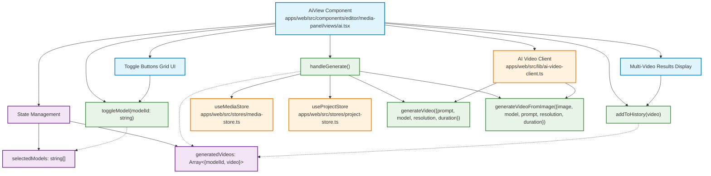

# Multi-Select AI Models Feature Plan

## Architecture Diagram



## Function and File Relationships

### Core Files Modified
- `apps/web/src/components/editor/media-panel/views/ai.tsx:47` - Change `selectedModel` to `selectedModels`
- `apps/web/src/components/editor/media-panel/views/ai.tsx:569-634` - Replace Select dropdown with toggle grid
- `apps/web/src/components/editor/media-panel/views/ai.tsx:278-400` - Update `handleGenerate` for multiple models
- `apps/web/src/components/editor/media-panel/views/ai.tsx:737-800` - Replace single video success with multi-video results

### Key Functions Flow
1. **toggleModel()** → Updates selectedModels array → Triggers UI re-render
2. **handleGenerate()** → Loops through selectedModels → Calls generateVideo() for each → Updates generatedVideos
3. **addToHistory()** → Adds each generated video to localStorage history
4. **Media Integration** → Each video auto-added to MediaStore via addMediaItem()


## Overview
Implement functionality to allow users to select multiple AI models simultaneously for video generation, giving them the option to generate videos with different models in parallel or compare results.

## Current Implementation Analysis

### Current State
- **File**: `apps/web/src/components/editor/media-panel/views/ai.tsx`
- **Current Selection**: Single model selection using `selectedModel` state (line 47)
- **UI Component**: Select dropdown with monospace font, clean white text on transparent background with blue hover effects
- **Generation**: Single model per generation request with history tracking
- **Models Available**: 6 AI models (Veo3, Veo3 Fast, Veo2, Hailuo, Kling v1.5, Kling v2.1)
- **Tabs**: Text-to-Video and Image-to-Video with transparent styling and hover effects

### Current Code Structure
```tsx
// State management (line 47)
const [selectedModel, setSelectedModel] = useState<string>("");

// Current dropdown implementation (lines 563-633)
<Select 
  value={selectedModel}
  onValueChange={setSelectedModel}
>
  <SelectContent className="bg-background border border-border/50 shadow-lg rounded-lg min-w-[280px] font-mono">
    {AI_MODELS.map((model, index) => (
      <Fragment key={model.id}>
        <SelectItem value={model.id} className="px-3 py-2 rounded-md hover:bg-accent/50">
          <div className="flex items-center justify-between w-full px-2">
            <span className="font-medium text-sm">{model.name}</span>
            <span className="text-xs text-muted-foreground">
              USD {model.price} • {model.resolution}
            </span>
          </div>
        </SelectItem>
        {index < AI_MODELS.length - 1 && <div className="mx-2 h-px bg-border my-1" />}
      </Fragment>
    ))}
  </SelectContent>
</Select>
```

## Implementation Approach: Toggle Buttons Grid

**Pros**:
- Clean visual selection interface
- Easy to see multiple selected models at once
- Intuitive toggle interaction
- Fits well with existing UI style
- Shows model information clearly

**Cons**:
- Requires more vertical space than dropdown

## Recommended Implementation Plan

### Step 1: Update State Management
**File**: `apps/web/src/components/editor/media-panel/views/ai.tsx`

```tsx
// Replace single model state
const [selectedModel, setSelectedModel] = useState<string>("");

// With multi-model state
const [selectedModels, setSelectedModels] = useState<string[]>([]);

// Helper functions
const toggleModel = (modelId: string) => {
  setSelectedModels(prev => 
    prev.includes(modelId) 
      ? prev.filter(id => id !== modelId)
      : [...prev, modelId]
  );
};

const isModelSelected = (modelId: string) => selectedModels.includes(modelId);
```

### Step 2: Create Toggle Buttons Grid UI Component

Replace the current Select dropdown with a toggle buttons grid that allows multiple selection:

```tsx
import { Check } from "lucide-react";

// Replace the current Select component with:
<div className="space-y-2">
  <Label htmlFor="models" className="text-sm font-medium text-foreground">
    AI Models
  </Label>
  <div className="grid grid-cols-1 gap-2 max-h-48 overflow-y-auto">
    {AI_MODELS.map((model) => (
      <Button
        key={model.id}
        type="button"
        variant="outline"
        size="sm"
        onClick={() => toggleModel(model.id)}
        className={`
          flex items-center justify-between p-3 h-auto text-left font-mono
          transition-all duration-200 border-border/50 
          ${isModelSelected(model.id) 
            ? 'bg-blue-500/10 border-blue-500/50 text-blue-400' 
            : 'bg-transparent hover:bg-accent/50 hover:border-border'
          }
        `}
      >
        <div className="flex items-center gap-3">
          <div className={`
            w-4 h-4 rounded border flex items-center justify-center
            ${isModelSelected(model.id) 
              ? 'bg-blue-500 border-blue-500' 
              : 'border-border bg-transparent'
            }
          `}>
            {isModelSelected(model.id) && (
              <Check className="w-3 h-3 text-white" />
            )}
          </div>
          <div className="flex flex-col">
            <span className="font-medium text-sm">{model.name}</span>
            <span className="text-xs text-muted-foreground">
              {model.description}
            </span>
          </div>
        </div>
        <span className="text-xs text-muted-foreground font-normal ml-6">
          USD {model.price} • {model.resolution}
        </span>
      </Button>
    ))}
  </div>
  
  {/* Quick Actions */}
  <div className="flex gap-2 pt-2">
    <Button
      type="button"
      size="xs"
      variant="text"
      onClick={() => setSelectedModels(AI_MODELS.map(m => m.id))}
      className="text-xs"
    >
      Select All
    </Button>
    <Button
      type="button"
      size="xs"
      variant="text"
      onClick={() => setSelectedModels([])}
      className="text-xs"
    >
      Clear All
    </Button>
  </div>
</div>
```

### Step 3: Update Generation Logic

Update the existing `handleGenerate` function to support multiple models:

```tsx
const handleGenerate = async () => {
  // Update validation to check for selectedModels instead of selectedModel
  if (activeTab === "text") {
    if (!prompt.trim() || selectedModels.length === 0) return;
  } else {
    if (!selectedImage || selectedModels.length === 0) return;
  }
  
  setIsGenerating(true);
  setError(null);
  setJobId(null);
  
  // Reset any existing generated videos
  setGeneratedVideos([]);
  
  try {
    const generations = [];
    
    // Sequential generation (recommended to avoid rate limits)
    for (let i = 0; i < selectedModels.length; i++) {
      const modelId = selectedModels[i];
      setStatusMessage(`Generating with ${AI_MODELS.find(m => m.id === modelId)?.name} (${i + 1}/${selectedModels.length})`);
      
      let response;
      
      if (activeTab === "text") {
        response = await generateVideo({
          prompt: prompt.trim(),
          model: modelId,
          resolution: "1080p",
          duration: 5
        });
      } else {
        response = await generateVideoFromImage({
          image: selectedImage!,
          model: modelId,
          prompt: prompt.trim() || undefined,
          resolution: "1080p",
          duration: 5
        });
      }
      
      if (response.status === "completed" && response.video_url) {
        const newVideo = {
          jobId: response.job_id,
          videoUrl: response.video_url,
          videoPath: response.video_url,
          fileSize: undefined,
          duration: 5,
          prompt: prompt.trim(),
          model: modelId
        };
        
        generations.push({ modelId, video: newVideo });
        
        // Add each video to history as it's generated
        addToHistory(newVideo);
        
        // Automatically add to media panel and download to Downloads folder
        if (activeProject) {
          try {
            const videoResponse = await fetch(newVideo.videoUrl);
            const blob = await videoResponse.blob();
            const modelName = AI_MODELS.find(m => m.id === modelId)?.name || modelId;
            const fileName = `ai-${modelName.toLowerCase()}-${newVideo.jobId.substring(0, 8)}.mp4`;
            const file = new File([blob], fileName, {
              type: 'video/mp4',
            });
            
            // Add to media panel
            await addMediaItem(activeProject.id, {
              name: `AI (${modelName}): ${newVideo.prompt.substring(0, 20)}...`,
              type: "video",
              file: file,
              url: newVideo.videoUrl,
              duration: newVideo.duration || 5,
              width: 1920,
              height: 1080,
            });
            
            // Automatically download to Downloads folder
            const downloadLink = document.createElement('a');
            downloadLink.href = URL.createObjectURL(blob);
            downloadLink.download = fileName;
            document.body.appendChild(downloadLink);
            downloadLink.click();
            document.body.removeChild(downloadLink);
            URL.revokeObjectURL(downloadLink.href);
            
            debugLogger.log('AIView', 'VIDEO_ADDED_TO_MEDIA_PANEL_AND_DOWNLOADED', { 
              videoUrl: newVideo.videoUrl,
              modelName,
              fileName,
              projectId: activeProject.id 
            });
          } catch (addError) {
            debugLogger.log('AIView', 'VIDEO_ADD_TO_MEDIA_PANEL_FAILED', { 
              error: addError instanceof Error ? addError.message : 'Unknown error',
              modelName: AI_MODELS.find(m => m.id === modelId)?.name,
              projectId: activeProject.id 
            });
          }
        }
      }
    }
    
    setGeneratedVideos(generations);
    setStatusMessage(`Generated ${generations.length} videos successfully!`);
    
  } catch (error) {
    setError(handleApiError(error));
    debugLogger.log('AIView', 'MULTI_GENERATION_FAILED', { 
      error: error instanceof Error ? error.message : 'Unknown error' 
    });
  } finally {
    setIsGenerating(false);
  }
};
```

### Step 4: Update UI for Multiple Results

```tsx
// Add new state for multiple videos
const [generatedVideos, setGeneratedVideos] = useState<Array<{
  modelId: string;
  video: GeneratedVideo;
}>>([]);

// Replace the existing single video success display with multi-video results
{generatedVideos.length > 0 && (
  <div className="mt-4 space-y-3">
    <div className="flex items-center gap-2 mb-3">
      <Play className="size-4 text-green-600" />
      <span className="text-sm font-medium text-green-700">
        {generatedVideos.length} Video{generatedVideos.length > 1 ? 's' : ''} Generated Successfully!
      </span>
    </div>
    
    <div className="text-sm text-green-700 mb-3">
      ✅ All videos automatically added to Media panel<br/>
      📁 Videos downloaded to your Downloads folder
    </div>
    
    {/* Individual video results */}
    <div className="space-y-2">
      {generatedVideos.map(({ modelId, video }) => {
        const model = AI_MODELS.find(m => m.id === modelId);
        return (
          <div key={modelId} className="bg-green-500/5 border border-green-500/20 rounded-lg p-3">
            <div className="flex justify-between items-center mb-2">
              <span className="font-medium text-sm text-green-700">
                {model?.name}
              </span>
              <span className="text-xs text-muted-foreground">
                USD {model?.price} • {model?.resolution}
              </span>
            </div>
            
            <div className="flex gap-2">
              <Button
                type="button"
                size="sm"
                variant="outline"
                onClick={() => {
                  const link = document.createElement('a');
                  link.href = video.videoUrl;
                  link.download = `ai-${model?.name.toLowerCase()}-${video.jobId.substring(0, 8)}.mp4`;
                  link.click();
                }}
                className="flex-1"
              >
                <Download className="mr-1 size-3" />
                Download
              </Button>
            </div>
          </div>
        );
      })}
    </div>
    
    {/* Actions for all videos */}
    <div className="flex gap-2 pt-2">
      <Button
        type="button"
        size="sm"
        variant="outline"
        onClick={() => {
          // Download all videos
          generatedVideos.forEach(({ modelId, video }) => {
            const model = AI_MODELS.find(m => m.id === modelId);
            const link = document.createElement('a');
            link.href = video.videoUrl;
            link.download = `ai-${model?.name.toLowerCase()}-${video.jobId.substring(0, 8)}.mp4`;
            link.click();
          });
        }}
        className="flex-1"
      >
        <Download className="mr-1 size-3" />
        Download All ({generatedVideos.length})
      </Button>
      <Button
        type="button"
        size="sm"
        variant="text"
        onClick={() => {
          setGeneratedVideos([]);
          setError(null);
          setStatusMessage("");
          setGenerationProgress(0);
        }}
        className="flex-1"
      >
        Generate Again
      </Button>
    </div>
  </div>
)}
```

### Step 5: Update Validation and Cost Display

Update the existing validation logic and cost display:

```tsx
// Update the canGenerate function (around line 415)
const canGenerate = (() => {
  if (isGenerating || selectedModels.length === 0) return false;
  if (activeTab === "text") {
    return prompt.trim().length > 0;
  } else {
    return selectedImage !== null;
  }
})();

// Update cost calculation
const totalCost = selectedModels.reduce((total, modelId) => {
  const model = AI_MODELS.find(m => m.id === modelId);
  return total + (model ? parseFloat(model.price) : 0);
}, 0);

// Replace the existing cost display section (around line 715) with:
{selectedModels.length > 0 && !generatedVideos.length && (
  <div className="mt-2 text-center">
    <span className="text-xs text-muted-foreground">
      Total Cost: USD {totalCost.toFixed(2)} • {selectedModels.length} model{selectedModels.length > 1 ? 's' : ''}
    </span>
  </div>
)}

// Update validation message (around line 724)
{!canGenerate && !isGenerating && generatedVideos.length === 0 && (
  <div className="mt-2 text-center">
    <span className="text-xs text-muted-foreground">
      {selectedModels.length === 0 ? "Select at least one AI model" : 
       activeTab === "text" ? "Enter a video description" : 
       "Upload an image"}
    </span>
  </div>
)}
```

## Technical Considerations

### Performance
- **Parallel Generation**: May hit rate limits or overwhelm the API
- **Sequential Generation**: Slower but more reliable
- **Progress Tracking**: Need to track progress for multiple concurrent generations

### User Experience
- **Clear Selection State**: Visual indication of selected models with checkboxes
- **Cost Transparency**: Show total cost for multiple models
- **Result Organization**: Clear labeling of which video came from which model
- **Quick Actions**: Easy way to select/deselect all models
- **Media Panel Integration**: All generated videos automatically appear in Media panel for easy access
- **Automatic Downloads**: Videos automatically download to user's Downloads folder for offline access
- **Workflow Integration**: Videos are immediately available for dragging to timeline

### Error Handling
- **Partial Failures**: Some models succeed, others fail
- **Rate Limiting**: Handle API rate limits gracefully
- **Model Availability**: Handle cases where certain models are unavailable

## Implementation Priority

1. **High Priority**
   - State management updates (selectedModel → selectedModels array)
   - Toggle buttons grid UI component 
   - Basic multiple model selection with checkboxes
   - Update validation logic for multiple models

2. **Medium Priority**
   - Sequential generation logic with progress tracking
   - Cost calculation and display updates
   - Multiple results display component
   - Quick actions (Select All, Clear All buttons)

3. **Low Priority**
   - Advanced result comparison interface
   - Export all generated videos functionality
   - Model performance analytics

## Files to Modify

1. **`apps/web/src/components/editor/media-panel/views/ai.tsx`**
   - Main component with multi-select logic
   - State management updates
   - UI component changes

2. **`apps/web/src/lib/ai-video-client.ts`** (if exists)
   - Update generation functions for multiple models
   - Add batch generation capabilities

3. **`apps/web/src/types/ai.ts`** (create if needed)
   - Type definitions for multi-model generation
   - Result interfaces

## Testing Checklist

### 🔍 UI/UX Testing (No Cost)
- [ ] Multi-model selection works correctly
- [ ] Cost calculation is accurate  
- [ ] Toggle buttons respond properly
- [ ] Select All / Clear All functions work
- [ ] Selected models info panel updates correctly
- [ ] Validation messages show properly
- [ ] UI responsive with many selected models

### 🧪 API Function Testing (No Video Generation)

#### Test 1: Dry Run Validation
```javascript
// Test the validation logic without API calls
const testValidation = () => {
  const selectedModels = ['veo3', 'hailuo', 'kling'];
  const prompt = "Test prompt";
  
  // Should return true for valid inputs
  console.log('Validation passed:', selectedModels.length > 0 && prompt.trim().length > 0);
  
  // Test cost calculation
  const totalCost = selectedModels.reduce((total, modelId) => {
    const model = AI_MODELS.find(m => m.id === modelId);
    return total + (model ? parseFloat(model.price) : 0);
  }, 0);
  console.log('Total cost:', totalCost.toFixed(2));
};
```

#### Test 2: Mock API Response Handler
```javascript
// Test the response processing logic with mock data
const testResponseHandling = () => {
  const mockResponse = {
    job_id: 'test-job-123',
    status: 'completed',
    video_url: 'https://example.com/test-video.mp4'
  };
  
  const mockModelId = 'veo3';
  const mockPrompt = 'Test video generation';
  
  // Test video object creation
  const newVideo = {
    jobId: mockResponse.job_id,
    videoUrl: mockResponse.video_url,
    videoPath: mockResponse.video_url,
    fileSize: undefined,
    duration: 5,
    prompt: mockPrompt,
    model: mockModelId
  };
  
  console.log('Mock video object:', newVideo);
  return newVideo;
};
```

#### Test 3: Generation Loop Logic (Without API Calls)
```javascript
// Test the multi-model generation loop structure
const testGenerationLoop = async () => {
  const selectedModels = ['veo3', 'hailuo', 'kling'];
  const generations = [];
  
  for (let i = 0; i < selectedModels.length; i++) {
    const modelId = selectedModels[i];
    const modelName = AI_MODELS.find(m => m.id === modelId)?.name;
    
    console.log(`Processing model ${i + 1}/${selectedModels.length}: ${modelName}`);
    
    // Mock successful response
    const mockVideo = {
      jobId: `mock-job-${i}`,
      videoUrl: `https://example.com/video-${modelId}.mp4`,
      model: modelId
    };
    
    generations.push({ modelId, video: mockVideo });
  }
  
  console.log('Generated results:', generations);
  return generations;
};
```

#### Test 4: Error Handling Simulation
```javascript
// Test error handling without real API failures
const testErrorHandling = () => {
  try {
    // Simulate API error
    const mockError = new Error('Rate limit exceeded');
    throw mockError;
  } catch (error) {
    console.log('Error handled:', error.message);
    // Test error message formatting
    const errorMessage = error instanceof Error ? error.message : 'Unknown error';
    console.log('Formatted error:', errorMessage);
  }
};
```

### 🎮 Interactive Testing Steps

#### Step 1: Component State Testing
1. Open browser dev tools
2. Navigate to AI Video Generation panel
3. Select multiple models using checkboxes
4. Verify `selectedModels` array updates in React DevTools
5. Check cost calculation updates in real-time
6. Test Select All / Clear All buttons

#### Step 2: Validation Testing
1. Try generating without selecting models → Should show "Select at least one AI model"
2. Try generating without prompt → Should show "Enter a video description"
3. Select models and enter prompt → Generate button should become enabled
4. Verify cost display shows correct total

#### Step 3: Mock API Testing (Recommended)
Add this temporary testing function to the component:

```typescript
// Add to ai.tsx for testing (remove before production)
const handleMockGenerate = async () => {
  if (selectedModels.length === 0) return;
  
  setIsGenerating(true);
  setGeneratedVideos([]);
  
  try {
    const mockGenerations: GeneratedVideoResult[] = [];
    
    for (let i = 0; i < selectedModels.length; i++) {
      const modelId = selectedModels[i];
      const modelName = AI_MODELS.find(m => m.id === modelId)?.name;
      
      setStatusMessage(`Mock generating with ${modelName} (${i + 1}/${selectedModels.length})`);
      
      // Simulate API delay
      await new Promise(resolve => setTimeout(resolve, 1000));
      
      const mockVideo: GeneratedVideo = {
        jobId: `mock-job-${Date.now()}-${i}`,
        videoUrl: 'https://sample-videos.com/zip/10/mp4/SampleVideo_1280x720_1mb.mp4',
        videoPath: 'https://sample-videos.com/zip/10/mp4/SampleVideo_1280x720_1mb.mp4',
        fileSize: 1024000,
        duration: 5,
        prompt: prompt.trim(),
        model: modelId
      };
      
      mockGenerations.push({ modelId, video: mockVideo });
    }
    
    setGeneratedVideos(mockGenerations);
    setStatusMessage(`Mock generated ${mockGenerations.length} videos!`);
    
  } catch (error) {
    console.error('Mock generation error:', error);
  } finally {
    setIsGenerating(false);
  }
};
```

### 🚨 Real API Testing (Use Sparingly - Costs Money)

#### Minimal Cost Testing
If you need to test real API integration:

1. **Single Model Test**: Select only cheapest model (Hailuo - $0.08)
2. **Short Prompt**: Use minimal prompt like "test"
3. **Monitor Costs**: Keep track of spending
4. **Test One Feature**: Focus on specific functionality

#### Production Testing
- [ ] Generation works with multiple models
- [ ] Error handling for partial failures  
- [ ] Results display correctly for each model
- [ ] Performance acceptable with multiple concurrent generations
- [ ] Videos properly added to Media panel
- [ ] Download functionality works
- [ ] History tracking functions correctly

### 🛠️ Debug Console Commands

Add these to browser console for testing:

```javascript
// Check current state
window.__REACT_DEVTOOLS_GLOBAL_HOOK__.renderers.forEach(r => {
  const fiber = r.findFiberByHostInstance?.(document.querySelector('[data-testid="ai-view"]'));
  if (fiber) console.log('AI View State:', fiber.memoizedState);
});

// Test cost calculation
const testCost = (modelIds) => {
  const AI_MODELS = [
    { id: "veo3", price: "3.00" },
    { id: "hailuo", price: "0.08" },
    { id: "kling", price: "0.10" }
  ];
  const total = modelIds.reduce((sum, id) => {
    const model = AI_MODELS.find(m => m.id === id);
    return sum + (model ? parseFloat(model.price) : 0);
  }, 0);
  console.log(`Models: ${modelIds.join(', ')} | Total: $${total.toFixed(2)}`);
};

// Example usage
testCost(['veo3', 'hailuo']); // Should show $3.08
```

## Future Enhancements

- **Model Comparison**: Side-by-side comparison of generated videos
- **Preset Selections**: Save common model combinations
- **Smart Recommendations**: Suggest model combinations based on prompt
- **Batch Export**: Export all generated videos at once
- **Quality Metrics**: Compare quality/cost ratios across models