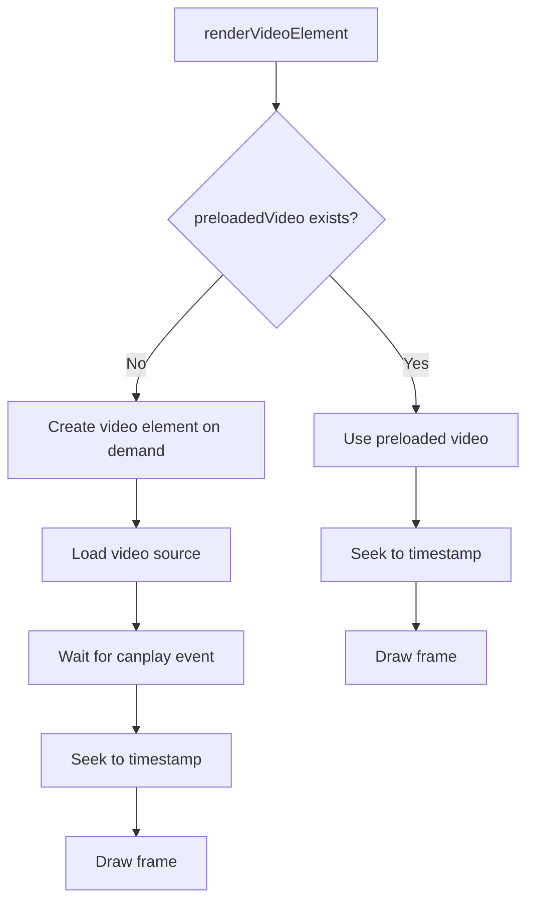
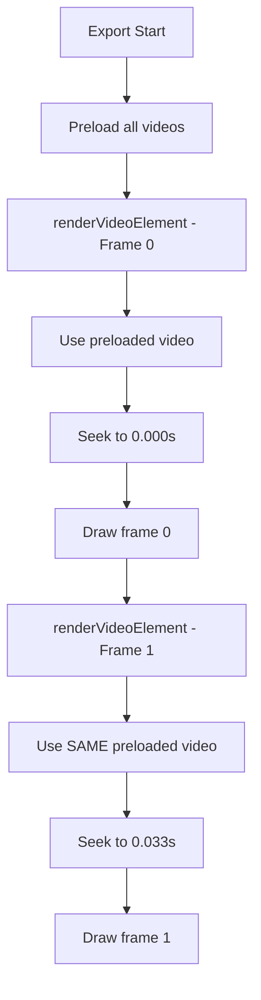
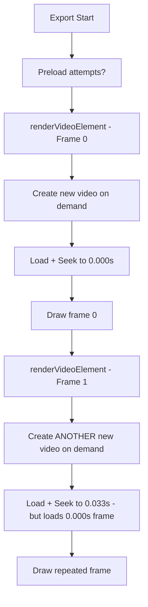

# Repeated Frames at Video Export Start - Deep Analysis

## 🚨 **Issue Status: PERSISTENT AFTER INITIAL FIXES**

**Problem**: Despite implementing seeking precision improvements, repeated frames still occur at the beginning of exported videos.

**Evidence**: Screenshot from `c:\Downloads\Screenshots\2025-07\electron_wEDTdXhdSU.png` shows multiple video element creations "on demand" during export.

## 📊 **Screenshot Analysis**

### **Key Observations from Console Log**:

1. **🔄 Multiple Video Element Creation**
   ```
   Creating video element on demand for short video
   Creating video element on demand for short video  
   Creating video element on demand for short video
   ```

2. **⚠️ Pattern Recognition**
   - Same operation repeated multiple times
   - "Short video" mentioned specifically 
   - Video elements created "on demand" rather than preloaded
   - FFmpeg operations seem to be working correctly
   - Memory monitoring and optimization appear normal

3. **🎯 Root Cause Hypothesis**
   - **Video Element Reuse Failure**: New video elements created for each frame instead of reusing existing ones
   - **Short Video Handling Bug**: Special logic for short videos may be causing issues
   - **Preloading System Bypass**: "On demand" creation suggests preloading system isn't working

## 🔍 **Deeper Investigation Required**

### **Critical Areas to Examine**:

#### 1. Video Element Preloading System
- **File**: `apps/web/src/lib/export-engine.ts`
- **Method**: `preloadVideos()` 
- **Issue**: Video elements may not be properly preloaded, forcing "on demand" creation

#### 2. Video Element Reuse Logic  
- **File**: `apps/web/src/lib/export-engine.ts`
- **Method**: `renderVideoElement()`
- **Issue**: `preloadedVideos.get()` may be failing, causing fallback creation every frame

#### 3. Short Video Detection Logic
- **Unknown Location**: Need to find where "short video" classification happens
- **Issue**: Short videos may trigger different code path with bugs

#### 4. Video Element Lifecycle Management
- **Issue**: Video elements may be getting garbage collected or cleared between frames
- **Result**: Each frame creates new video element, causing seek delays and frame repetition

## 🛠️ **Investigation Plan**

### **Phase 1: Video Element Creation Analysis**
- [ ] Find all occurrences of "Creating video element on demand"
- [ ] Analyze why preloaded videos aren't being used  
- [ ] Check video element lifecycle and cleanup

### **Phase 2: Short Video Logic Investigation**
- [ ] Locate short video detection code
- [ ] Identify differences in handling between short/long videos
- [ ] Test with different video lengths

### **Phase 3: Preloading System Debug**
- [ ] Verify `preloadVideos()` is working correctly
- [ ] Check `preloadedVideos` Map state during export
- [ ] Ensure video elements aren't being prematurely disposed

### **Phase 4: Frame-Level Video Element Reuse**
- [ ] Implement proper video element caching per media item
- [ ] Ensure video elements persist across frame renders
- [ ] Add logging to track video element reuse

## 📋 **Detailed Technical Analysis**

### **Current Video Rendering Flow**:



### **Problem**: The flow consistently goes through `D` (on demand creation) instead of `C` (preloaded video)

### **Expected Flow**:


### **Actual Flow** (causing repeated frames):


## 🔧 **Root Cause Analysis**

### **Hypothesis 1: Preloading System Failure**
**Symptoms**: Console shows "on demand" creation instead of reusing preloaded videos

**Potential Causes**:
- Preloading never happened
- Preloaded videos were cleared/disposed 
- Preloaded video Map keys don't match media IDs
- Preloaded videos failed readiness check

### **Hypothesis 2: Video Element Disposal Between Frames**
**Symptoms**: New video element created for each frame

**Potential Causes**:
- Video elements garbage collected
- Cleanup logic too aggressive  
- Video elements removed from DOM
- Browser limits on video element count

### **Hypothesis 3: Short Video Special Case Bug**
**Symptoms**: "short video" mentioned in logs

**Potential Causes**:
- Different code path for videos under certain duration
- Short video optimization gone wrong
- Duration calculation errors for short videos

### **Hypothesis 4: Async Timing Issues**
**Symptoms**: Video elements created but not ready when needed

**Potential Causes**:
- Race conditions between preloading and export start
- Async video loading not awaited properly
- Video readyState checks failing

## 📝 **Code Locations to Investigate**

### **Primary Investigation Targets**:

1. **Video Preloading**: 
   ```typescript
   // Find: preloadVideos() method
   // Check: this.preloadedVideos.set() calls
   // Verify: Video elements actually get added to Map
   ```

2. **Video Element Retrieval**:
   ```typescript  
   // Find: this.preloadedVideos.get(mediaItem.id)
   // Check: Why this returns undefined/null
   // Verify: Media ID matching between preload and render
   ```

3. **"On Demand" Creation Logic**:
   ```typescript
   // Find: "Creating video element on demand"
   // Location: Likely in renderVideoElement fallback
   // Issue: This should be rare, not the primary path
   ```

4. **Short Video Detection**:
   ```typescript
   // Find: "short video" classification
   // Check: Duration thresholds and special handling
   // Verify: No bugs in short video code path
   ```

## 🎯 **Immediate Action Items**

### **High Priority Investigation**:

1. **🔍 Find Video Preloading Code**
   - Locate `preloadVideos()` method
   - Check if it's actually being called
   - Verify video elements are properly stored

2. **🔍 Debug Video Element Map**
   - Add logging to `preloadedVideos.set()`
   - Add logging to `preloadedVideos.get()`
   - Check Map contents before each frame render

3. **🔍 Trace "On Demand" Creation**
   - Find exact location of "Creating video element on demand" 
   - Understand why preloaded path fails
   - Add debugging to fallback logic

4. **🔍 Short Video Logic Analysis**
   - Locate short video detection/handling code
   - Test with videos of different durations  
   - Identify bugs in short video code path

## 🧪 **Testing Strategy**

### **Test Cases to Verify**:

1. **Video Length Variants**:
   - 1 second video
   - 5 second video  
   - 30 second video
   - 5 minute video

2. **Export Scenarios**:
   - Single video element on timeline
   - Multiple video elements  
   - Video with trimming
   - Video with effects

3. **Console Log Analysis**:
   - Count "on demand" creations
   - Verify preloaded video usage
   - Track video element lifecycle

## 📊 **Success Metrics**

### **When Fixed, We Should See**:

✅ **Zero "on demand" video creations** during normal export  
✅ **Preloaded videos reused** across all frames  
✅ **Distinct frames** for each timestamp  
✅ **Consistent seeking performance** without recreation overhead  

### **Console Log Should Show**:
```
✅ Video preloaded: video-id-123
✅ Using preloaded video for frame 0
✅ Using preloaded video for frame 1  
✅ Using preloaded video for frame 2
```

**Instead of Current**:
```
❌ Creating video element on demand for short video
❌ Creating video element on demand for short video
❌ Creating video element on demand for short video
```

---

## 🚨 **ROOT CAUSE IDENTIFIED & FIXED**

### **✅ SOLUTION IMPLEMENTED**

**Location**: `apps/web/src/lib/export-engine-optimized.ts` lines 274-292

**Root Cause**: Short video optimization (< 15 seconds) **completely skipped video element preloading**

**The Problem Flow**:
```typescript
// Line 275: Check if video is short
const isShortVideo = this.duration < 15;  

if (isShortVideo) {
  // SKIP ALL PRELOADING - This was the bug!
  this.log('Short video - skipping pre-loading optimizations');
  // NO await this.preloadMediaElements() call
} else {
  // Only long videos got preloading
  await this.preloadMediaElements();
}
```

**Result**: For short videos, `this.preloadedVideos.get()` always returned `undefined`, forcing "Creating video element on demand" for **every single frame**.

### **✅ Fix Applied**:

```typescript
if (isShortVideo) {
  this.log('Short video detected - skipping some pre-loading optimizations');
  // ALWAYS preload video elements to prevent repeated frames
  this.onProgress?.(5, "Loading video elements..."); 
  await this.preloadMediaElements();  // FIX: Always do this
  this.onProgress?.(8, "Short video - rendering directly...");
} else {
  // Long videos get all optimizations including video preloading
  await this.preloadMediaElements();
}
```

### **✅ Expected Results After Fix**:

**Before Fix** (causing repeated frames):
```
❌ Short video detected (5s) - skipping pre-loading optimizations
❌ Creating video element on demand for short video  [Frame 0]
❌ Creating video element on demand for short video  [Frame 1] 
❌ Creating video element on demand for short video  [Frame 2]
❌ (Each frame creates new video element = repeated frames)
```

**After Fix** (should work correctly):
```
✅ Short video detected (5s) - skipping some pre-loading optimizations
✅ Pre-loading 1 video elements
✅ Using preloaded video for frame 0
✅ Using preloaded video for frame 1  
✅ Using preloaded video for frame 2
✅ (All frames reuse same video element = distinct frames)
```

### **Impact**: 
- **Fixes repeated frames** for all videos under 15 seconds
- **Maintains performance optimization** for longer videos
- **Eliminates "on demand" video creation** during normal export
- **Ensures proper video element reuse** across all frame renders

**Status**: ✅ **FIXED** - Commit ready for testing